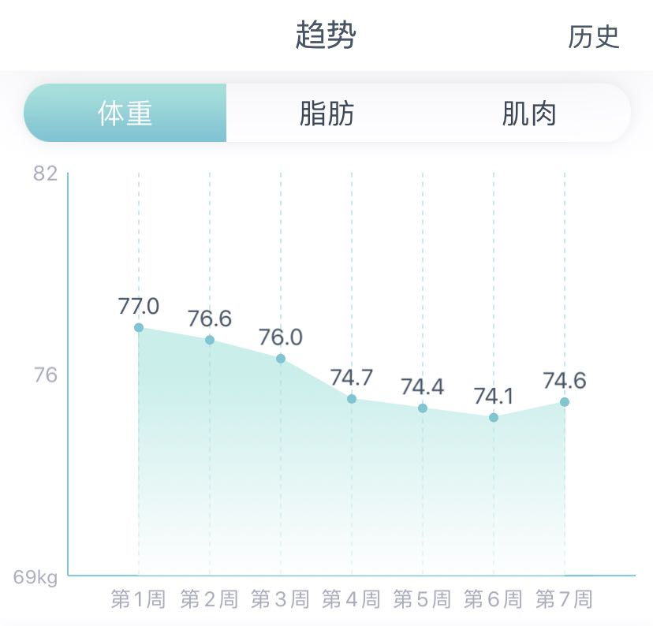

## 减肥和（还没有）锻炼
### 目标是把体重控制在BMI标准内，按照当前身高，我需要把体重控制在67.7以下
   我是从9月份中旬左右开始，由84减到现在的75。慢慢的习惯了控制饮食，保持好的饮食习惯。
虽然生活中缺少了美味的糖，巧克力，蛋糕，汽水，奶茶这些毒药。一开始减肥的时候，还是挺有难度的。
由于在上班，每天的生活作息都比较规律，12之后睡觉，8点多起床。
减肥的原理很简单，摄入量小于消耗量，自然会减下去，重要的是坚持。
- 早上会就买一个茶叶蛋，为了中午不会感到太饿，
一定要吃一个鸡蛋，增加饱腹感。避免中午太饿吃撑了。
- 中午正常吃，吃饱，不能吃撑。不能吃油腻的肉，饭最多一碗。
- 晚上比较随便，但是不能吃主食。可以番薯，意大利面，低脂少油的健身外卖都可以。
比较重要的是千万不能吃太饱，并且保持八点之后不能进食。
- 在公司和家里，不能有任何的零食。当饿的时候可以喝水，也可以等五分钟，如果还是觉得饿，那就多喝点水。
- 不能吃甜的东西，奶茶糖果巧克力蛋糕是千万不能吃的。保持一日三餐。  

### 找了一下别的爱好
由于生活中是不能缺少这些看着就无限吸引你的食物，所以我关注了B站的很多UP主。
- 徐大sao
- 蛋黄派
- 韩国搞笑的综艺
还有很多美食的up主，我也忘记名字了，都是每天动态一刷，一个个看下去。
当能够看遍世间美味，但是心中仍有执念的时候，我觉得我减肥成功了，并且很难会反弹。

### 可怕11.30-12.1号周末，解释下趋势图的曲线
- 周六那天，中午起床之后，点了一份炭烤芝麻酱的鸡胸肉意大利面。晚上下着冻入骨髓的雨，还跑到楼下的清真面馆吃了份潘茄盖饭。
这一天的除了吃得多了点，还好。但是在回来的路上，肉虫上脑，买了20块钱五花肉。
- 周日的时候，红烧五花肉的香味让我9点钟就起来了。玩手机到10.30。就爬起来烧肉（厨艺来自众多的UP主）。
有一点开始想吃肉的念头在这一刻无限放大。但是最后由于肥肉太多，吃了10块小肉左右，有点腻到自己了。晚上吃了一大份的蒜泥水饺。
吃撑了，晚上一点钟的时候，还感觉肚子沉甸甸的。很久没有这种难受的感觉了。同时也有点后悔。

## 锻炼
谈及我减肥的初心，是由于身体超重，导致双腿关节疼痛，加上比较顺利的工作。自然而然的就开始了。
锻炼这件事情我是有考虑的，就是为了身体健康，和得到多年来从未拥有的好身材，我打算到了70KG的时候，开始去健身房锻炼。

## 这里记录身体的每一天的数据
  这是在我买了新的体脂秤之后的数据统计图
  
- 12.2，体重稳定保持在75KG以下，早上称的话，73.5左右
- 12.3,

## 关于技术
### 有的是工作中用到的

### 有的是自己纯粹没事干，学点有意思的

## 关于摄影
相机太尼玛贵了，镜头像是个无底洞，没有家底，明年条件好点，可以开始。
