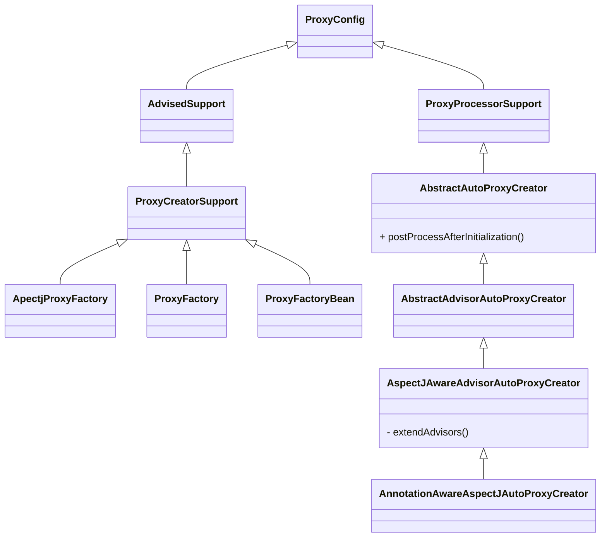

# Spring-aop

## 基本概念

### Pointcut（切点）

用于判断是否可以符合增强的条件，例如方法名称和参数是否正确（如果设置了的话）等。

```java
public interface Pointcut {
	/** 
	 * Return the ClassFilter for this pointcut.
	 * @return the ClassFilter (never  null)
	 */
	ClassFilter getClassFilter();// 返回可以判断这个类是否可以增强过滤器
	/**
	 * Return the MethodMatcher for this pointcut.
	 * @return the MethodMatcher (never null )
	 */
	MethodMatcher getMethodMatcher();// 返回判断方法是否可以增强的匹配器
	/**
	 * Canonical Pointcut instance that always matches.
	 */
	Pointcut TRUE = TruePointcut.INSTANCE;

}
```


### Advice（切面增强）

```java
public interface MethodBeforeAdvice extends BeforeAdvice {
	// 前置增强
   void before(Method method, Object[] args, @Nullable Object target) throws Throwable;
}
```

### advisor（通知器）

将上面两个概念联合起来

#### 在责任链中

- 先调用`Pointcut`的`mather.matches`方法判断是否匹配
- 在调用对应的`Advice`的方法

## SpringAOP设计分析




### ProxyCreatorSupport

子类创建AOP对象的辅助类。通过继承`AdvisedSupport`,也有了提供通知`Advice`和通知器`Advisor`的一些操作。

#### ApectjProxyFactory

起到集成`Spring`和`ApectJ`的作用。

#### ProxyFactory

以编程方式使用AOP的功能。

#### ProxyFactoryBean

在IOC容器中声明式配置。

## 代理的创建过程

###  advised的来源

```java
// 从BeanPostProcessor调用 postProcessAfterInitialization是BeanPostProcessor的一个方法的实现
AbstractAutoProxyCreator.postProcessAfterInitialization{
	AbstractAutoProxyCreator.wrapIfNecessary{
		interfaces=AbstractAdvisorAutoProxyCreator.getAdvicesAndAdvisorsForBean{
			// 获取有资格的advisor
			AbstractAdvisorAutoProxyCreator.findEligibleAdvisors{
				// 找到候选的advisor
                AnnotationAwareAspectJAutoProxyCreator.findCandidateAdvisors{
                    AbstractAdvisorAutoProxyCreator.findCandidateAdvisors{
                        BeanFactoryAdvisorRetrievalHelper.findAdvisorBeans{
                            // 从beanFactory中找到所有的Advisor的实现类，获得所有的beanName
                            advisorNames = BeanFactoryUtils.beanNamesForTypeIncludingAncestors( 
                                            beanFactory, Advisor.class, true, false);
                            // 放入到缓存中,下次直接取缓存中的上次加载好的
                            cachedAdvisorBeanNames = advisorNames;
                            // 如果这些beanName中的对象没有初始化，那么就通过beanfactory初始化
                            // 并添加到返回的advisors数组中返回
                            advisors.add(this.beanFactory.getBean(name, Advisor.class));
                        }
                    }
                    // 获得aspectj相关的advisor
                    BeanFactoryAspectJAdvisorsBuilder.buildAspectJAdvisors{
                        // 获取beanFactory中所有的bean，
                        // 判断类是否有@Aspect注解
                        AbstractAspectJAdvisorFactory.isAspect(clazz)
                        // 如果是单例的，直接加入到advisors中，如果是非单例，则另外处理
                    }
                }
                // 找到当前要代理的bean能用的Advisor
                AbstractAdvisorAutoProxyCreator.findAdvisorsThatCanApply{
                    // 找到 实现了PointcutAdvisor接口
                    AopUtils.findAdvisorsThatCanApply(candidateAdvisors, beanClass){
                     	AopUtils.canApply(Pointcut pc, Class<?> targetClass, boolean){
                            // TODO 介入增强 IntroductionAwareMethodMatcher
                            // 如果有任何的方法符合代理，则这一整个对象都要被代理
                         	MethodMatcher.matches(Method, java.lang.Class<?>)
                        }
                    }
                }
                // 拓展Aspectj，添加用于让aspectj拦截器了解上下调用链的拓展
                AspectJAwareAdvisorAutoProxyCreator.extendAdvisors{
                    AspectJProxyUtils
                            .makeAdvisorChainAspectJCapableIfNecessary(candidateAdvisors){
                    	// 如果存在与aspectj相关advisor
                        // 同时不存在ExposeInvocationInterceptor.ADVISOR
                        if(AspectJProxyUtils.isAspectJAdvice(advisor) == true)
                        	advisors.add(0, ExposeInvocationInterceptor.ADVISOR);
                        // 可以在使用ExposeInvocationInterceptor.currentInvocation();静态方法获取当前目标方法，做一些定制化处理
                    }
                }
                // 如果最后返回的advisors不为空，根据ordered进行排序
                AbstractAdvisorAutoProxyCreator.sortAdvisors
			}
		}// 获取有资格的advisor end
		AbstractAutoProxyCreator.createProxy(interfaces){
            // 可以拦截AOP的BeanPostProcessor，强制添加一些AdvisorAdapter的实现。
			advisors=AbstractAutoProxyCreator.buildAdvisors(interfaces)
			ProxyFactory(advisors).getProxy{
				aopProxy=ProxyFactory.createAopProxy{
					ProxyCreatorSupport.getAopProxyFactory{
                        return DefaultAopProxyFactory的实例
                    }
                    DefaultAopProxyFactory.createAopProxy(){
                        // 返回一个AopProxy 根据方法条件，生成CGlibAopProxy或是jdkAopProxy
                        // 具体方法实现在下面
                    }
				}
                // 这个方法真正返回一个代理对象
                (AopProxy)aopProxy.getProxy{
                    // 返回jdk动态代理或者是cglib生成的代理对象
                }
			}
		}
	}
}
```

### 调用链的初始化

直接获得`AbstractAutoProxyCreator`的关于父类`ProxyConfig`的属性，生成一个新的`ProxyFactory`这个就是新的`advised`，

在`ProxyFactory`初始化的时候，其父类`AdvisedSupport`也初始化了，因此`advisorChainFactory`也在这个过程被初始化了。

### 创建cglib/jdk代理的回调

```java
@Override
public AopProxy createAopProxy(AdvisedSupport config) throws AopConfigException {
		if (config.isOptimize() || config.isProxyTargetClass() || hasNoUserSuppliedProxyInterfaces(config)) {
			Class<?> targetClass = config.getTargetClass();
			if (targetClass == null) {
				throw new AopConfigException("TargetSource cannot determine target class: " +
						"Either an interface or a target is required for proxy creation.");
			}
			if (targetClass.isInterface() || Proxy.isProxyClass(targetClass)) {
				return new JdkDynamicAopProxy(config);
			}
			return new ObjenesisCglibAopProxy(config);
		}
		else {
			return new JdkDynamicAopProxy(config);
		}
	}
```


### AbstractSingletonProxyFactoryBean

一个方便的单例对象代理实现，其实现类`CacheProxyFactoryBean`和`TransactionProxyFactoryBean`是用于**XML**配置的。

## 调用

### JDK

```java
// 这个是jdk动态代理的回调方法
JdkDynamicAopProxy.invoke{
    // 获得所有拦截器 也就是拦截链
    this.advised.getInterceptorsAndDynamicInterceptionAdvice(method, targetClass);
    MethodInvocation invocation = new ReflectiveMethodInvocation() // 创建反射方法调用的实例
    invocation.proceed{
        // 递归调用proceed()方法，详细看代码。
        AspectJAroundAdvice.invoke(this){
            // 组合参数，然后调用方法。因为如果是around的话，多一个JoinPoint的参数
            AbstractAspectJAdvice.invokeAdviceMethodWithGivenArgs{
                // java反射调用注册的切面增强
             	this.aspectJAdviceMethod.invoke{
                    // 如果是around增强
                    // 则需要在around注册的方法中调用 joinpoint.proceed() 并最后返回其返回值
                    return joinpoin.proceed()
                }
            }
        }
    }
}
```

### Cglib

```
// 这个是cglib代理的回调
CglibAopProxy.DynamicAdvisedInterceptor.intercept{
	 
	 MethodInvocation invocation = new CglibMethodInvocation()
	 invocation.proceed{
	 	// 覆写只是为了捕获异常和不允许代理的方法是非public方法。最后会抛出AopInvocationException
	 	super.prceed{
	 		// 剩下的同jdk代理。
	 	}
	 	
	 }
	 
}
```


### proceed()方法，责任链调用

```java
@Override
@Nullable
public Object proceed() throws Throwable {
   // We start with an index of -1 and increment early.
    
   // 最后一次调用，发现已经是最后一个了，则直接执行对应对象的方法
   if (this.currentInterceptorIndex == this.interceptorsAndDynamicMethodMatchers.size() - 1) {
      return invokeJoinpoint();
   }

   Object interceptorOrInterceptionAdvice =
         this.interceptorsAndDynamicMethodMatchers.get(++this.currentInterceptorIndex);
   if (interceptorOrInterceptionAdvice instanceof InterceptorAndDynamicMethodMatcher) {
      // Evaluate dynamic method matcher here: static part will already have
      // been evaluated and found to match.
       // 一般为判断apectj调用的方法是否符合表达式
      InterceptorAndDynamicMethodMatcher dm =
            (InterceptorAndDynamicMethodMatcher) interceptorOrInterceptionAdvice;
      Class<?> targetClass = (this.targetClass != null ? this.targetClass : this.method.getDeclaringClass());
      if (dm.methodMatcher.matches(this.method, targetClass, this.arguments)) {
         return dm.interceptor.invoke(this);
      }
      else {
         // Dynamic matching failed.
         // Skip this interceptor and invoke the next in the chain.
         return proceed();
      }
   }
   else {
      // It's an interceptor, so we just invoke it: The pointcut will have
      // been evaluated statically before this object was constructed.
       //   ExposeInvocationInterceptor 并且一般是第一个，
       // 例如缓存的拦截器，
      return ((MethodInterceptor) interceptorOrInterceptionAdvice).invoke(this);
   }
}
```


## IntroductionAdvisor


## HotSwapTargetSource的使用

可以通过参数配置，热替换

- `org.springframework.aop.framework.JdkDynamicAopProxy#invoke`
- `org.springframework.aop.framework.CglibAopProxy.DynamicAdvisedInterceptor#intercept`

根据jdk/cglib回调方法 源码中可知targetsource的来源于

`TargetSource targetSource = this.advised.getTargetSource();`

最后查到这个对象是在`AbstractAutoProxyCreator#postProcessBeforeInstantiation`设置进去的。

而获取这个targetsource的方法就是` AbstractAutoProxyCreator#getCustomTargetSource`

```java
@Nullable
protected TargetSource getCustomTargetSource(Class<?> beanClass, String beanName) {
   // We can't create fancy target sources for directly registered singletons.
   if (this.customTargetSourceCreators != null &&
         this.beanFactory != null && this.beanFactory.containsBean(beanName)) {
      for (TargetSourceCreator tsc : this.customTargetSourceCreators) {
         TargetSource ts = tsc.getTargetSource(beanClass, beanName);
         if (ts != null) {
            // Found a matching TargetSource.
            if (logger.isTraceEnabled()) {
               logger.trace("TargetSourceCreator [" + tsc +
                     "] found custom TargetSource for bean with name '" + beanName + "'");
            }
            return ts;
         }
      }
   }

   // No custom TargetSource found.
   return null;
}
```


可以看到获取了bean工厂中的

## AOP解决循环依赖

https://www.jianshu.com/p/3bc6c6713b08?from=timeline

