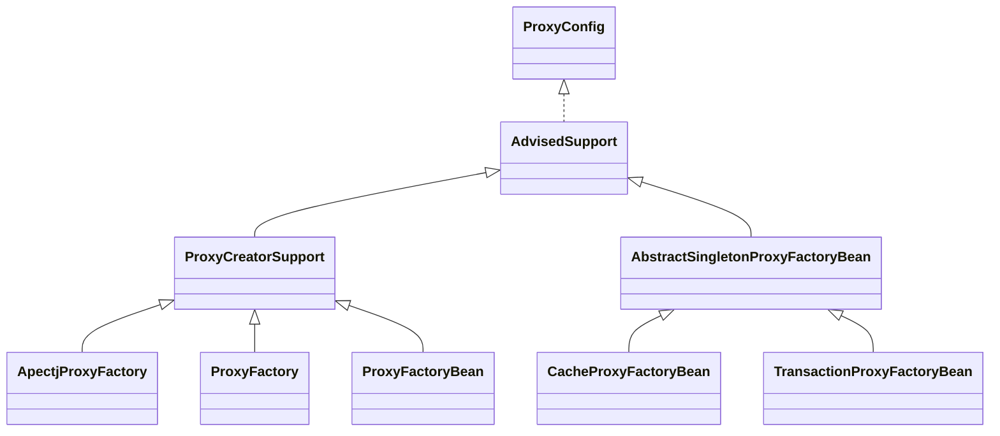
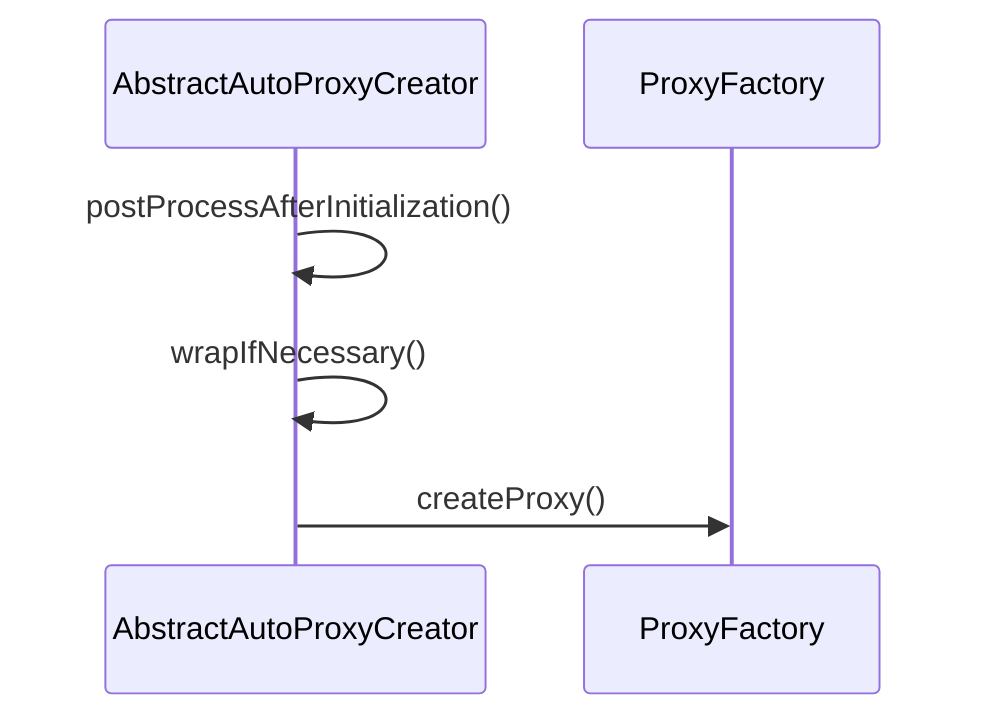

# Spring-aop

## 基本概念

### pointcut（切点）


### advice（切面增强）


### advisor（通知器）

将上面两个概念联合起来


## SpringAOP设计分析




### ProxyCreatorSupport

子类创建AOP对象的辅助类。通过继承`AdvisedSupport`,也有了提供通知`Advice`和通知器`Advisor`的一些操作。

#### ApectjProxyFactory

起到集成`Spring`和`ApectJ`的作用。

#### ProxyFactory

以编程方式使用AOP的功能。

#### ProxyFactoryBean

在IOC容器中声明式配置。


advised的来源

直接获得`AbstractAutoProxyCreator`的关于父类`ProxyConfig`的属性，生成一个新的`ProxyFactory`这个就是新的`advised`，

在`ProxyFactory`初始化的时候，其父类`AdvisedSupport`也初始化了，因此`advisorChainFactory`也在这个过程被初始化了。


```java
// 从BeanPostProcessor调用 postProcessAfterInitialization是BeanPostProcessor的一个方法的实现
AbstractAutoProxyCreator.postProcessAfterInitialization{
	AbstractAutoProxyCreator.wrapIfNecessary{
		interfaces=AbstractAdvisorAutoProxyCreator.getAdvicesAndAdvisorsForBean{
			// 获取有资格的advisor
			AbstractAdvisorAutoProxyCreator.findEligibleAdvisors{
				// 找到候选的advisor
				AbstractAdvisorAutoProxyCreator.findCandidateAdvisors{
					BeanFactoryAdvisorRetrievalHelper.findAdvisorBeans{
						// 从beanFactory中找到所有的Advisor的实现类，获得所有的beanName
						advisorNames = BeanFactoryUtils.beanNamesForTypeIncludingAncestors( 
										beanFactory, Advisor.class, true, false);
						// 放入到缓存中,下次直接取缓存中的上次加载好的
						cachedAdvisorBeanNames = advisorNames;
						// 如果这些beanName中的对象没有初始化，那么就通过beanfactory初始化
						// 并添加到返回的advisors数组中返回
						advisors.add(this.beanFactory.getBean(name, Advisor.class));
					}
				}
                // 找到当前要代理的bean能用的Advisor
                AbstractAdvisorAutoProxyCreator.findAdvisorsThatCanApply{
                    // 找到 实现了PointcutAdvisor接口
                    AopUtils.findAdvisorsThatCanApply(candidateAdvisors, beanClass){
                     	AopUtils.canApply(Pointcut pc, Class<?> targetClass, boolean){
                            // TODO 介入增强 IntroductionAwareMethodMatcher
                            // 如果有任何的方法符合代理，则这一整个对象都要被代理
                         	MethodMatcher.matches(Method, java.lang.Class<?>)
                        }
                    }
                }
                // 拓展Aspectj
                AspectJAwareAdvisorAutoProxyCreator.extendAdvisors{
                    AspectJProxyUtils
                            .makeAdvisorChainAspectJCapableIfNecessary(candidateAdvisors){
                    	// 如果不存在与aspectj的advisor，则在开头添加一个aspectj的advisor,
                        // 同时不存在ExposeInvocationInterceptor.ADVISOR
                        if(AspectJProxyUtils.isAspectJAdvice(advisor) == true)
                        	advisors.add(0, ExposeInvocationInterceptor.ADVISOR);
                    }
                }
                // 如果最后返回的advisors不为空，根据ordered进行排序
                AbstractAdvisorAutoProxyCreator.sortAdvisors
			}
		}// 获取有资格的advisor end
		AbstractAutoProxyCreator.createProxy(interfaces){
            // 可以拦截AOP的BeanPostProcessor，强制添加一些AdvisorAdapter的实现。
			advisors=AbstractAutoProxyCreator.buildAdvisors(interfaces)
			ProxyFactory(advisors).getProxy{
				aopProxy=ProxyFactory.createAopProxy{
					ProxyCreatorSupport.getAopProxyFactory{
                        return DefaultAopProxyFactory的实例
                    }
                    DefaultAopProxyFactory.createAopProxy(){
                        // 返回一个AopProxy 根据方法条件，生成CGlibAopProxy或是jdkAopProxy
                        // 具体方法实现在下面
                    }
				}
                // 这个方法真正返回一个代理对象
                (AopProxy)aopProxy.getProxy{
                    // 返回jdk动态代理或者是cglib生成的代理对象
                }
			}
		}
	}
}
```


```java
@Override
public AopProxy createAopProxy(AdvisedSupport config) throws AopConfigException {
		if (config.isOptimize() || config.isProxyTargetClass() || hasNoUserSuppliedProxyInterfaces(config)) {
			Class<?> targetClass = config.getTargetClass();
			if (targetClass == null) {
				throw new AopConfigException("TargetSource cannot determine target class: " +
						"Either an interface or a target is required for proxy creation.");
			}
			if (targetClass.isInterface() || Proxy.isProxyClass(targetClass)) {
				return new JdkDynamicAopProxy(config);
			}
			return new ObjenesisCglibAopProxy(config);
		}
		else {
			return new JdkDynamicAopProxy(config);
		}
	}
```

r

advisors的来源（Advice的来源）




### AbstractSingletonProxyFactoryBean

一个方便的单例对象代理实现，其实现类`CacheProxyFactoryBean`和`TransactionProxyFactoryBean`是用于XML配置的。


TODO 


