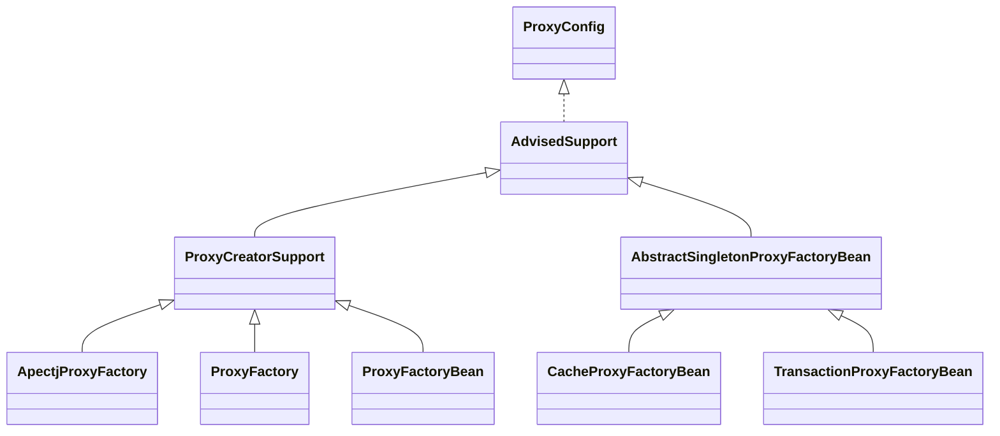

# Spring-aop

## 基本概念

### pointcut

### advice

### advisor

通知器，将上面两个概念联合起来

## SpringAOP设计分析

### ProxyCreatorSupport

子类创建AOP对象的辅助类。通过继承`AdvisedSupport`,也有了提供通知`Advice`和通知器`Advisor`的一些操作。

#### ApectjProxyFactory

起到集成`Spring`和`ApectJ`的作用。

#### ProxyFactory

以编程方式使用AOP的功能。

#### ProxyFactoryBean

在IOC容器中声明式配置。

### AbstractSingletonProxyFactoryBean

一个方便的单例对象代理实现，其实现类`CacheProxyFactoryBean`和`TransactionProxyFactoryBean`是用于XML配置的。

TODO 

