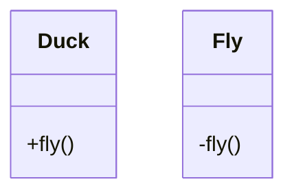
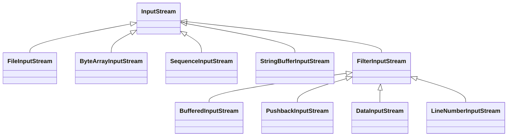

# 设计模式

## 策略模式

鸭子，鸭鸣器，




## 观察者模式

气象监测应用的显示


## 装饰者模式

Decorator pattern，装饰器模式。也叫包装器模式（Wrapper Pattern）,是指在不改变原有对象的基础上，将功能附加到对象上，

提供了比继承更有弹性的替代方案（扩展原有对象的功能）

　　属于结构型模式。

`JavaIO` 类



## 工厂模式

### 工厂方法

工厂方法一般用于创建一个具体的实现类。

如创建不同口味的pizza

### 抽象工厂

抽象工厂用于创建相关或依赖对象的家族，而不需要明确指定具体类。

如创建pizza的原材料（面粉，芝士，等等原料）

一般具体的原料也可以使用**工厂方法**进行创建

## 单例模式

### 多线程（双检查锁，double-checked locking）

```java
public class Singleton {
    // volatile 关键字保证，当uniqueInstance被实例时，多个线程能正确的获取uniqueInstance变量
    private volatile static Singleton uniqueInstance;
    private Singleton() {}
    public static Singleton getInstance() {
        // 检查实例，如果不存在就进入同步块
        if (uniqueInstance == null) {
            // 注意，只有第一次才彻底执行这里的代码
            synchronized(Singleton.class) {
                // 进入同步块后，再次检查，如果还是null才创建。
                if (uniqueInstance == null) {
                    uniqueInstance = new Singleton();
                }
            }
        }
        return uniqueInstance;
    }
}
```


## 门面模式

Facade Pattern,又称外观模式。提供一个统一的接口，用来访问子系统中的一群接口。

属于结构型设计模式。

