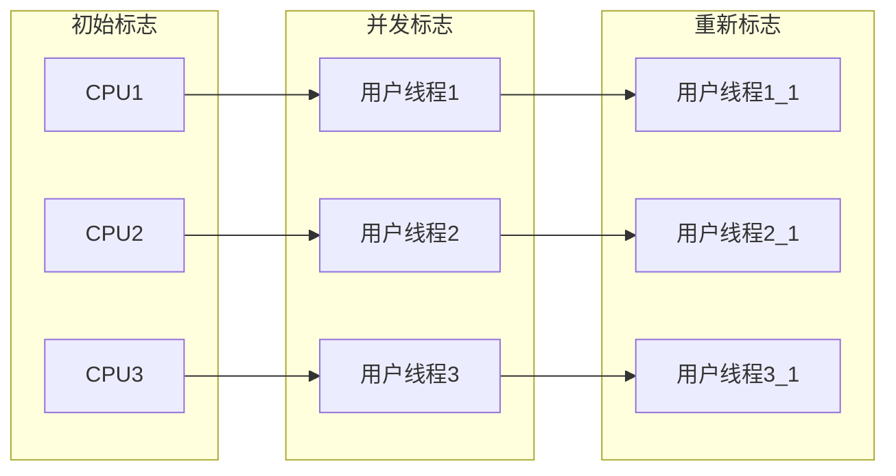
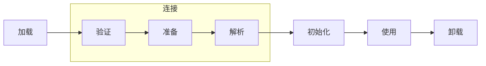
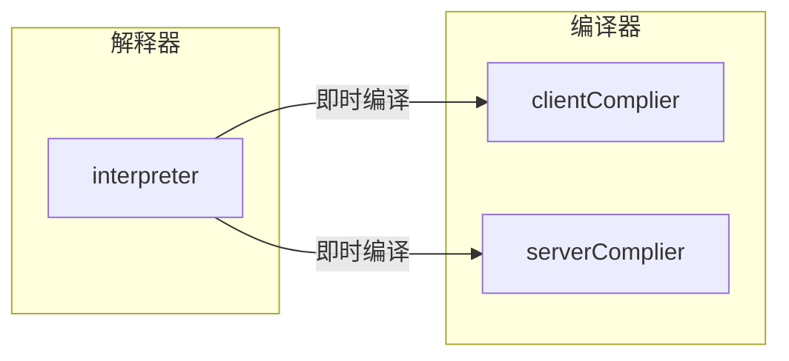

# JAVA SE8虚拟机规范

## 类型
### 整数类型
| 类型  | 说明                      | byte字节数 | 默认值 | 范围            |
| ----- | ------------------------- | ---------- | ------ | --------------- |
| byte  | 8bit的二进制补码表示      | 1          | 0      | -2^7~ (2^7)-1   |
| short | 16bit的二进制补码表示     | 2          | 0      | -2^15~ (2^15)-1 |
| int   | 32bit的二进制补码表示     | 4          | 0      | -2^31~ (2^31)-1 |
| long  | 64bit的二进制补码表示     | 8          | 0      | -2^63~ (2^63)-1 |
| char  | from 0 to 65535 inclusive | 2          |        | 0~2^16-1        |

### 浮点数类型


### 返回地址，The returnAddress Type and Values
返回地址，指令`jsr`, `ret`, `and`和`jsr_w`会使用到returnAddress，returnAddress的值是指向操作码的指针，
与原始类型不同，returnAddress不与任何Java编程类型相对应，并且不能由正在运行的程序更改。说白了就是一种类型


### boolean类型
尽管JVM虚拟机定义了boolean类型，但是对它的支持很有限，并且没有专门针对boolean的操作指令，
实际上，boolean类型被编译为int类型。 
对于boolean类型数组，实际上创建的数组是byte类型的，使用`baload`和`bastore`指令进行操作和存储 
在oracle虚拟机中，boolean数组就是byte数组，每个boolean元素就是一个byte，占用8个字节。 
并且java虚拟机声明1为true,0为false,如果要是int类型的话，也必须是0或1。


### 引用类型 Reference Types and Values
引用类型有三种，Interface types, Class types, Array types。它们的值分别引用动态创建的类实例，数组或实现接口的类实例或数组。


## 运行数据区

### 程序计数器
每个JAVA线程都有自己的程序计数器寄存器，每个java虚拟机线程都在执行单个方法的代码，即该线程的当前方法。 
如果不是native方法，则这个计数器包含当前正在执行的Java虚拟机指令的地址（运行到哪一行代码）。 
如果是native方法，则计数器的值是空的（未定义）。如果计数器的长度足够长，可以在特定平台上保存一些额外的信息，如returnAddress或是一个native pointer


### java虚拟机栈（Java Virtual Machine Stacks）
每个Java线程都有一个自己的虚拟机栈，并且和线程同时创建。虚拟机栈保存的是**栈帧**（`stack frame`）。每个方法被执行时，都会同步创建一个栈帧，用于存储局部变量表，操作数栈，动态链接，方法出口等。因为对于虚拟机栈，除了入栈出栈外，从不直接操作虚拟机栈，所以可以从堆中分配栈帧给虚拟机栈。java虚拟机栈不必是连续的。 
可以是固定大小，也可以是动态的。hotspot中是固定大小的。 
Java虚拟机实现可以为程序员或用户提供对Java虚拟机堆栈的初始大小的控制，并且在动态扩展或收缩Java虚拟机堆栈的情况下，可以控制最大和最小。


### 堆（heap）
Java虚拟机具有一个所有线程之间共享的堆，堆是运行时数据区，从中分配**所有类实例和数组的内存。** 
堆的大小是可以固定的，可以根据需要进行调整堆的大小。 
如果堆内存不够用，会触发OOM异常

### 本地方法栈

本地方法栈是为虚拟机执行本地方法服务的。

### 元空间

存储加载的类的字节码，常量池，静态变量。

### 直接内存

直接内存并不是虚拟机运行时数据区的一部分，也不是Java虚拟机定义的内存区域。

JDK1.4加入了NIO（new Input/Output）类，因为了通道（channel）于缓冲区（Buffer）的I/O方式，它可以使用Native函数库直接分配堆外内存，然后通过存储在Java里面的`DirectByteBuffer`对象作为这块内存的引用进行操作。

## 对象

### 对象的内存布局（对象头）

对象在堆内存中的存储布局可以分为三个部分：

- 对象头（Header）
- 实例数据（Instance Data）
- 对齐填充（Padding）

HotSpot对象头（MarkWord)分为三部分

- 25个字节，存储HashCode
- 4个字节，分代年龄
- 2个字节，存储锁标志位
- 1个字节，固定为0

### 对象的内存分配

对象创建在虚拟机内部是非常频繁的行为，即使仅仅修改一个指针所指向的位置，在并发的情况下，也并不是线程安全的，可能出现正在给A对象分配内存，指针还没来得及修改，对象B又同时使用了原来的指针来分配内存的情况。有两种可选方案

- **同步**：对分配对象的动作进行同步处理，实际上虚拟机是采用CAS配上失败重试的方式保证更新操作的原子性。
- **TLAB**：把内存分配的动作按照线程划分在不同的空间之中进行，即每个线程在Java堆中预先分配一小块内存，成为本地线程分配缓冲（Thread Local Allocation Buffer，TLAB），哪个线程需要分配内存，就在哪个线程的本地缓冲中分配，分配新的缓冲区时才需要同步锁定。虚拟机是否要使用TLAB，可以通过`-XX:+/-UseTLAB`参数来设定。

## 对象已死

程序计数器、虚拟机栈、本地方法栈3个区域随线程而生，线程而灭，栈中的栈帧随着方法的进入和退出而有条不紊的进行真入栈和出栈操作。每一个栈帧分配多少内存基本上是在类结构确定下来时就已知的。因此这三个区域的内存分配和回收都具有确定性。在这几个区域内就不需要过多考虑如何回收的问题，当方法结束或线程结束时，内存自然就跟随着回收了。

**内存回收**

主要是针对：Java堆和方法区这两个区域

### 引用计数法

每多一个对象引用便会加一，当引用失效时减一。优点是实现简单。缺点是无法解决互相循环引用的问题。

### 可达性分析算法

当前主流的商用程序语言(JAVA, C#)的内存管理子系统，都是使用的可达性分析算法。

思路是通过一系列GCRoots的根对象作为起始节点集。从这些节点开始，根据引用关系向下搜索，搜索过程所走过的路径成为**引用链**。如果某个对象到`GC Roots`间没有任何引用链相连，或者用图论的话来说就是从GC Roots到这个对象不可达，则证明这个对象不再被使用。

#### GC Roots

- 在虚拟机栈（栈帧的本地变量表）中引用的对象，**各个线程被调用的方法堆栈中使用到的参数、局部变量、临时变量等**。
- 在方法区中的类静态属性引用的对象，譬如Java类的引用类型静态变量
- 在方法区内常量引用的对象，譬如字符串常量池（String table）里的引用
- 本地方法栈中JNI（Native方法）引用的对象。
- Java虚拟机内部引用，如基本数据类型Class对象，还有常驻的异常对象，比如`NullPointException`,`OutOfMemoryError`等。还有系统类加载器。
- 所有被同步锁（synchronized）持有的对象。
- 反应JVM内部情况的JMXBean，JVMTI中注册的回调，本地代码缓存等。

除了这些固定的`GC Roots`集合以外，根据用户选择不同的垃圾收集器以及当前回收的内存区域不同，还可以有其他对象临时性加入，共同构建完整的`GC Roots`集合。比如分代收集理论（Minor GC）和局部收集（Partial GC）

### 强软弱虚引用

- 强引用：new 出来的对象或者是通过反射生成的对象。只要强引用关系还存在，就不能被GC

- 软引用：`SoftReference`，用来描述还有用，但非必须的对象。在系统发生内存溢出前，会把软引用的对象列入到回收范围内进行二次回收，如果还是内存不足，才会抛出内存溢出异常。

- 弱引用：`WeakReference`，弱引用的对象只能生存到下一次垃圾收集为止。经过测试来看CMS minorGC就会回收，而PS MinorGC不会回收，只有full gc才会被serial old回收

  ```java
  public class TestClass {
      // -Xms5m -Xmx5m -XX:+PrintGCDetails -verbose:gc
      // -Xms5m -Xmx5m -XX:+PrintGCDetails -verbose:gc   -XX:+UseConcMarkSweepGC
      public static void main(String[] args) {
          WeakReference<BigByte> re1 = new WeakReference<>(new BigByte());
          WeakReference<BigByte> re2 = new WeakReference<>(new BigByte());
          WeakReference<BigByte> re3 = new WeakReference<>(new BigByte());
          WeakReference<BigByte> re4 = new WeakReference<>(new BigByte());
      }
      public static class BigByte {
          private byte[] bytes = new byte[1024 * 1024 * 2];
      }
  }
  ```

- 虚引用：`PhantomReference` 虚引用，会在被GC的后，将对象放到一个队列中。一般用于管理堆外内存。

  ```java
  ReferenceQueue<Long> queue = new ReferenceQueue<>();
  // 会在被GC时，添加到这个队列中，这样就表示这个对象没有引用了，可以被回收了。然后手动回收NIO中的内存
  PhantomReference<Long> re = new PhantomReference<>(System.currentTimeMillis(), queue);
  ```

### finalize

即使在可达性分析中被判定为不可达对象，也不是一定就会被回收。这时候该对象处于被缓刑阶段，要宣告一个对象真正死亡，至少要经历两次标记过程。

- 第一次标记是在可达性分析算法分析发现没有与GC Roots相连接的引用链。
- 第二次标记，是在可达性分析之后执行的，判断是否有必要执行finalize方法，如果没有覆盖这个方法，或者finalize已经被调用过。虚拟机将这两种情况视为 没有必要执行

如果在finalize中和GCRoots生成了引用链，则不会被回收。

## 垃圾收集算法

### 分代收集理论

1. 弱分代假说理论。绝大多数对象都是朝生夕灭的
2. 强分代假说理论。熬过也多次收集的对象越难消除。
3. 跨代引用假说理论。跨代引用相对于同代引用来说仅占极少数。


### 标记-清除算法

算法分为标志-和清除两个阶段。

### 标记-复制算法

也叫半区复制算法。将可用内存分为大小等分的两块，每次只是用其中一块。当用完时，就将存活的对象全部复制到另外一块。再把已使用的内存空间一次性全部清理掉。

根据新生代中对象的朝生夕死的特性，后来提出了更优化的半区复制分代策略。将新生代分为Eden、Survivor0和Survivor1三块空间，其中survivor0和1的大小一样。Hotspot虚拟机默认Eden:Survivor=8:1。 也就是新生代的可用内存为90%（Eden的80%+一个Survivor的10%），只有剩下的一个Survivor的10%内存是浪费的。

当然，并不能保证每次回收新生代之后存活的对象都不超过10%，所以有了空间担保原则的保证。一旦一个Survivor容纳不行这些对象，则需要依赖老年代进行空间担保。

### 标记-整理 算法

标记存活的对象，然后让所有存活的对象移动到空间一端，再将边界以外的内存清理。**老年代使用的是这种算法**。

整理会比较耗时，Hotspot中关注吞吐量的PS收集器使用的是标记整理算法，对于低延迟的CMS则是基于标记清除算法。

还有一种CMS使用的算法。平时多数时间使用标记-清除算法，直到碎片化程度影响到对象分配的时候，再采用标记-整理算法收集一次。

## HOTSPOT垃圾收集算法细节

### 根节点（GC Roots）枚举

为了加快枚举速度，避免对每一个方法的对象栈进行轮询，设置了保存这些引用对象的数据结构OopMap，用于一次性读取引用对象。

- OopMap，在加载动作完成的时候，虚拟机就会把对象内什么偏移量上什么类型的数据计算出来，在JIT过程中，也会在特定的位置记录下栈里和寄存器里哪些位置是引用；这个特定的位置被称为安全点（safePoint）。记录这个数据的数据结构在hotspot中被称为OopMap
- JNI(java native interface)方法使用句柄调用java对象，java对象调用JNI也要将自身包装为句柄调用

### 安全点（SafePoint）

安全点一般设置在

- 方法返回之前/方法调用的call命令之后
- 循环的末尾
- 可能抛异常的位置

如果设置了安全点，程序执行中就会涉及到中断，主动中断和被动中断。hotspot中使用的是主动中断。主动式中断不需要对每个线程进行操作，仅仅设置一个标志位，各个线程执行过程中会不停的主动轮询这个标志位，一旦发现标志位为True，就自己在最近的安全点主动中断挂起。轮询标志的地方和安全点是重合的。hotspot采用内存保护陷阱的方式，将标志位的内存设置为不可读，线程便会挂起等待，这样仅通过一条汇编指令便完成了标志位轮询和主动中断挂起。

### 安全区域

针对没有执行的代码，如用户线程处于sleep,blacked状态时，无法执行到安全点。当用户线程执行到安全区域时，会标志自己进入到了安全区域，根节点枚举便不去管进入安全区域的线程，因为在安全区域中的任意地方收集垃圾都是安全的。一旦线程要退出安全区域，则需要判断是否在进行根节点枚举，有则等待根节点枚举结束。

### 记忆集和卡表

跨代引用假说中，说明JVM不必要为了少量的跨代引用去扫描整个老年代，也不必浪费空间专门记录每一个对象是否存在及存在哪些跨代引用，只需在新生代上建立一个全局的数据结构，也就是记忆集。这个结构把老年代划分为多个小块，标识出老年代的那块内存存在跨代引用。此后发生MinorGC时，只有包含了跨代引用的小块内存里的对象才会被加入`GC Roots`	进行扫描。所以这是为了解决对象跨代引用带来的问题。

**其中卡表是记忆集最常见的实现**

字节数组`CARD_TABLE`的每一个元素对应着其标识的内存区域中一块特定大小的内存块（卡页CardPage），Hotspot的卡页为2的9次幂等于512字节。

一个卡页中不止包含一个对象，只要卡页中存在至少一个对象存在跨代指针，那就将对应卡表的数组元素的值标识为1，称这个元素为脏（dirty），垃圾收集时，将含有跨代指针的卡页加入GCRoot中一并被扫描。

### 写屏障

解决谁来维护卡表，如何把卡页变脏的问题。

写屏障可以看作在虚拟机层面对"引用类型字段赋值"这个动作的AOP切面，在引用对象复制时会产生一个环形（Around）通知，供程序执行额外的动作，也就是说赋值的前后都在写屏障的覆盖范围内。在赋值钱的写屏障叫做写前屏障（Pre-Write Barrier），当然也就有写后屏障（Post-Write Barrier）。知道G1出现前，其他收集器都只用到了写后屏障。


### 并发的可达性分析


## 并行与并发

### 并发(Concurrent)

描述的是垃圾收集器线程于用户线程之间的关系，说明同一时间垃圾收集器线程和用户线程都在运行，由于用户线程并未被冻结，所以程序仍能响应服务请求，但是由于垃圾收集器线程占用了一部分系统资源，此时应用程序的处理的吞吐量将受到一定影响

### 并行（parallel）

描述的是多个垃圾收集器线程之间的关系，说明同一时间有多条这样的线程在协同工作，通常默认此时用户线程处于等待状态。

## 收集器

### serial

- 标记-整理算法，将已用的内存都整理到堆的前面
- 标记-复制算法，将已用的内存都复制到另外的survivor
- 新生代采用标志-复制算法，老年代采用标记-整理算法


### ParNew

- serial的多线程版本


### PS （Parallel Scavenge)

关注吞吐量
`吞吐量=运行用户代码时间/(运行用户代码时间 + 运行垃圾收集时间)`

- 新生代收集器
- 基于标记-复制算法
- `-XX:GCTimeRatio=99`垃圾收集器占总时间的比例
- `-XX:MaxGCPauseMillis=70`最大垃圾收集停顿时间。
- `-XX:UseAdaptiveSizePolicy`自适应调节策略，动态调整一些参数，不需要指定。**这也是Parallel scavenge区别于ParNew最重要的特征**

### CMS

CMS（Concurrent Mark Sweep）收集器是一种以获取最短回收为目标的收集器。




过程

1. 初始标记
2. 并发标记
3. 重新标记
4. 并发清除
5. 参数`-XX:+UseCMS-CompactAtFullCollection`，默认开启整理碎片，无法并发

采用空闲列表来分配内存。如果内存不够大，则会发生一次`minorGC`

缺点

- 无法处理浮动垃圾，有可能出现“Con-current Mode Failure”失败进而导致另一次完全“Stop The World”。无法等待老年代满了再收集，因为还要再保留一下内存空间给并发线程使用。需要设置触发FullGC的已用内存百分比的阈值。参数`-XX:CMSInitatingOccupancyFraction`来设置百分比。

- 由于是基于“标记-清除”算法实现的收集器，垃圾收集之后会有大量空间碎片。

  CMS提供了一个-XX:+UseCMS-CompactAtFullCollection开关参数（默认开启，JDK9废弃），用于在CMS收集器不得不进行FullGC时开启内存碎片的合并整理过程，由于内存这里必须移动存活对象，无法并发。增加了停顿时间。

### G1

分为多个region，每个region都需要卡表，很费内存，相当于Java堆容量的**10%-20%**，建议内存大于8G的时候，在使用G1收集器。

### 内存分配与回收策略

如何给对象分配内存，从概念上讲，对象的内存分配应该在堆上分配，但是实际也有可能经过JIT后被拆散为标量类型并间接地在栈上分配）。在经典分代的设计下，新生对象通常会分配在新生代中，少数情况下（例如对象大小超过一定的阈值）也有可能直接分配在老年代。

#### 对象有限在Eden分配

大多数情况下，对象在新生代Eden区中分配。当Eden区没有足够空间进行分配时，虚拟机将发起一次`Minor GC`

#### 大对象直接进入老年代

大对象就是指需要大量连续内存空间的Java对象，最典型的大对象便是那种很长的字符串，或者元素数量很庞大的数组。

Hotspot提供了`-XX:PretenureSizeThreshold=【4135728】`仅仅（Serial/ParNew+CMS）的收集器下可用，来指定大于该设置值的对象直接在老年代分配。避免大对象在Eden和两个Survivor直接来回复制，产生大量的内存复制操作

#### 长期存活的对象直接进入老年代

一般来说，对象的分代年龄达到15才进入老年区。也可以通过设置参数`-XX:MaxTrnuringThreshold`来设置进入老年代的年龄。

#### 动态对象年龄判断

**如果在Survivor空间中相同年龄所有对象大小的总和大于Survivor空间的一半，年龄要求大于等于该年龄的对象直接进入老年代**。无需等到`-XX:MaxTrnuringThreshold`要求的年龄。

#### 空间分配担保(如果不能担保就需要发生Full GC)

在发生MinorGc之前，虚拟机必须先检查老年代最大空用的连续空间是否大于新生代所有存活对象总空间，如果这个条件成立，那这一次MinorGC可以确保安全。如果不成立，则虚拟机会先查看`-XX:HandlePromotionFailure`参数的设置值是否允许担保失败，如果允许，那会继续检查老年代最大可用的连续空间是否大于历次晋升到老年代对象的平均大小，如果大于，将尝试进行一次MinorGC，尽管这次MinorGC是有风险的；如果小于，或者`XX:HandlePromotionFailure`设置不允许，那这时就要改为一次FullGC

**JDK6之后，规则变为只要老年代的连续空间大于新生代对象总大小或者历次晋升到老年代的平均大小，就会进行MinorGC**


## JVM 类加载

### 类的生命周期

**加载-（验证-准备-解析）[连接]-初始化-使用-卸载**




#### 初始化时机

会执行`static{}`语块

1. new对象的时候，读取静态字段的时候（static final修饰除外，因为在编译期将结果放置到常量池中了），调用静态方法的时候
2. 使用反射调用的时候
3. 初始化一个类的时候，发现父类还没有初始化，则先初始化父类
4. 当虚拟机启动的时候，先初始化主类
5. 当使用JDK 7新加入的动态语言支持时，如果一个`java.lang.invoke.MethodHandle`实例最后的解析结果为`REF_getStatic`、`REF_putStatic`、`REF_invokeStatic`、`REF_newInvokeSpecial`四种类型的方法句柄，并且这个方法句柄对应的类没有进行过初始化，则需要先触发其初始化。
6. 当接口定义了default方法时，如果这个接口的实现类发生了初始化，那该接口要在类之前被初始化


### 加载

加载时整个类加载的一部分。在加载阶段，JVM需要完成三件事

1. 通过一个类的全限定名来获取定义此类的二进制字节流
2. **将这个字节流代表的静态存储结构转化为方法区的运行时数据**
3. 在内存中生成代表这个类的`java.lang.Class`对象，作为方法区这个类的各种数据的访问入口。

### 验证

- 文件格式验证
- 元数据验证
  - 这个类是否有父类（除了java.lang.Object）
  - 是否继承了final类
  - 如果不是抽象类，是否实现了所有接口或抽象类方法
  - 是否出现不正确的覆盖字段或方法重载
- 符号引用验证（import 是否有，可访问性）

### 准备


​				

### 解析


## 类加载器

#### 类与类加载器

类加载器虽然只用于实现类的加载动作，但它在Java程序中起到的作用远超类加载阶段。对于任意一个类，都必须由加载它的类加载器和这个类本身一起共同确立在JVM中的唯一性，**都拥有一个独立的类名称空间**。

**比较两个类是否“相等”，只有这两个类是由同一个类加载器加载的前提下才有意义，否则这两个类来源于同一个Class文件，被同一个虚拟机加载，只要加载它们的类加载器不同，那这两个类就必不相等。**

“相等” ☞包括代表类对象的`equals`,`isAssignableFrom`,`isInstance`方法的返回结果。也包括`instanceof`的条件判定

类加载器是线程安全的

```java
protected Class<?> loadClass(String name, boolean resolve) throws ClassNotFoundException {
    synchronized (getClassLoadingLock(name)) { // 线程安全
        // First, check if the class has already been loaded
        Class<?> c = findLoadedClass(name);
        if (c == null) {
            long t0 = System.nanoTime();
            try {
                if (parent != null) {
                    c = parent.loadClass(name, false);
                } else {
                    c = findBootstrapClassOrNull(name);
                }
            } catch (ClassNotFoundException e) {
                // ClassNotFoundException thrown if class not found
                // from the non-null parent class loader
            }
            if (c == null) {
                // If still not found, then invoke findClass in order
                // to find the class.
                long t1 = System.nanoTime();
                c = findClass(name);

                // this is the defining class loader; record the stats
                sun.misc.PerfCounter.getParentDelegationTime().addTime(t1 - t0);
                sun.misc.PerfCounter.getFindClassTime().addElapsedTimeFrom(t1);
                sun.misc.PerfCounter.getFindClasses().increment();
            }
        }
        if (resolve) {
            resolveClass(c);
        }
        return c;
    }
}
```


#### 双亲委派模型


##### BootstrapLoader

启动类加载器，由C++实现，加载`<JAVA_HOME>\lib`目录或`—XbootClasspath`参数指定的路径，能够根据文件名识别，如`rt.jar`、`tools.jar`，名字不符合也不会被加载

##### ExtLoader

拓展类加载器，Java实现，加载`<JAVA_HOME>\lib\ext`目录中或`java.ext.dirs`系统变量指定的路径中**所有的类库**

##### ApplicationLoader

应用程序类加载器，它是`ClassLoader`类中`getSystemClassLoader`方法的返回值，它负责加载 用户类路径上所有的类库，程序中默认的类加载器。

##### UserApplicationLoader

用户自定义的类加载器

## 虚拟机字节码执行引擎

### 运行时栈帧结构

#### 局部变量表

#### 操作数栈

#### 动态链接

#### 方法返回地址


### 方法调用

方法调用并不等同于方法中的代码被执行，方法调用阶段唯一的任务就是确定被调用方法的版本（即调用哪一个方法），暂时还未设计方法内部的具体运行过程。方法调用有五个虚拟机字节码指令

- `invokestatic` 用于调用静态方法
- `invokespecial` 用于调用实例构造器`<init>()`方法、私有方法和父类中的方法
- `invokevirtual`用于调用所有的虚方法
- `invokeinterface`用于调用接口方法，会在运行时再确定一个实现该接口的对象
- `invokedynamic`由用户设定的引导方法决定

#### 解析

调用目标方法在代码写好，编译器进行编译那一刻就已经确定下来。这类方法的调用被称为解析。

在Java语言中符合“编译期可知，运行期不可变”这个要求的方法，主要有静态方法和私有方法两大类，前者与类型直接关联，后者在外部不可被访问，这两种方法的各自特点决定了它们都不可能通过继承或别的方式重写出其他版本，因此他们都适合在类加载阶段进行解析。

只有能被`invokestatic`和`invokespecial`指令调用的方法，都可以在解析阶段确定唯一的调用版本。符合的有**静态方法、私有方法、实例构造器、父类方法**四种，再加上**`final`修饰的方法**（尽管它使用`invokevirtual`指令调用），这五种方法会在类加载的阶段就可以把符号因为解析为方法的直接引用。这些方法被统称为**“非虚方法”**。

#### 分派

分派是因为重载等问题，编译器或虚拟机决定执行哪个方法的方案。

##### 静态分派

```java
public void sayHello(Human h) {
    System.out.println("human");
}
public void sayHello(Man h) {
    System.out.println("man");
}
public void sayHello(Woman h) {
    System.out.println("woman");
}

public static void main() {
    Human man = new Man();
    Human woman = new Woman();
    man.sayHello();
    woman.sayHello();
   	// 输出
    // human
    // human
}
```

解释：虚拟机在重载时时通过参数的静态类型（Human）而不是实际类型作为判定依据的。由于静态类型在编译期可知，所有在编译阶段，Javac编译器就根据参数的静态类型决定了使用哪个重载版本，因此选择了`sayHell(Human)`作为调用目标，并把这个方法的符号引用写道main()方法里的两条invokestatic指令的参数中。

##### 动态分派

```java
/**
 * 字段不参与多态 * @author zzm
 */
public class FieldHasNoPolymorphic {
    static class Father {
        public int money = 1;

        public Father() {
            money = 2;
            showMeTheMoney();
        }

        public void showMeTheMoney() {
            System.out.println("I am Father, i have $" + money);
        }
    }

    static class Son extends Father {
        public int money = 3;

        public Son() {
            money = 4;
            showMeTheMoney();
        }

        public void showMeTheMoney() {
            System.out.println("I am Son, i have $" + money);
        }
    }

    public static void main(String[] args) {
        Father gay = new Son();
        System.out.println("This gay has $" + gay.money);
        // 输出 
        // I am Son, i hava $0
        // I am Son, i hava $4
        // This gay has $2
    }
}
```

输出两句都是“I am Son”，这是因为在Son类创建的时候，首先隐式了调用Father的构造函数，而Father构造函数中对`showMeTheMoney()`的调用是一次虚方法调用，实际执行的是`Son::showMeTheMoney()`，所以输出的是“I am Son”。这时候虽然父类的money字段已经被初始化为2了，但`Son::showMeTheMoney()`访问的是子类中的money字段，这时候结果自然还是0，因为它要到子类的构造函数执行时才会被初始化。

### 动态类型语言支持


### 基于栈的字节码解释执行引擎

方法里代码的具体如何执行

#### 解释执行

#### 基于栈的指令集与基于寄存器的指令集

#### 基于栈的解释器执行过程


## 前端编译与优化

编译过程分为1个准备过程和3个处理过程

1. 准备过程：初始化插入式注解处理器
2. 解析与填充符号表过程
   - 词法语法分析。将源代码的字符流转为标记集合，构造出抽象语法树
   - 填充符号表，产生符号地址和符号信息
3. 插入式注解处理器的注解处理过程
4. 分析与字节码生成
   - 标注检查
   - 数据流和控制流分析
   - **解语法糖**
   - 字节码生成

## 后端编译与优化




### 编译器优化

#### 方法内联

在前面的讲解中，我们多次提到方法内联，说它是编译器最重要的优化手段，甚至都可以不加 上“之一”。内联被业内戏称为优化之母，因为除了消除方法调用的成本之外，它更重要的意义是为其他优化手段建立良好的基础，没有内联，多数其他优化都无法有效进行。例子里`testInline()`方法的内部全部是无用的代码，但如果不做内联，后续即使进行了无用代码消除的优化，也无法发现任何“Dead Code”的存在。如果分开来看，`foo()`和`testInline()`两个方法里面的操作都有可能是有意义的。

```java
public static void foo(Object obj) {
    if (obj != null) {
        System.out.println("do something");
    }
}

public static void testInline(String[] args) {
    Object obj = null;
    foo(obj);
}
```


#### 逃逸分析

逃逸分析（Escape Analysis）是目前Java虚拟机中比较前沿的优化技术，它与类型继承关系分析一样，并不是直接优化代码的手段，而是为其他优化措施提供依据的分析技术。

逃逸分析的基本原理是：分析对象动态作用域，当一个对象在方法里面被定义后，它可能被外部方法所引用，例如作为调用参数传递到其他方法中，这种称为方法逃逸；甚至还有可能被外部线程访问到，譬如赋值给可以在其他线程中访问的实例变量，这种称为**线程逃逸**；从不逃逸、方法逃逸到线程逃逸，称为对象由低到高的不同逃逸程度。

如果能证明一个对象不会逃逸到方法或线程之外（换句话说是别的方法或线程无法通过任何途径 访问到这个对象），或者逃逸程度比较低（只逃逸出方法而不会逃逸出线程），则可能为这个对象实 例采取不同程度的优化，如：

- 栈上分配（Stack Allocations）：在Java虚拟机中，Java堆上分配创建对象的内存空间几乎是 Java程序员都知道的常识，Java堆中的对象对于各个线程都是共享和可见的，只要持有这个对象的引用，就可以访问到堆中存储的对象数据。虚拟机的垃圾收集子系统会回收堆中不再使用的对象，但回收动作无论是标记筛选出可回收对象，还是回收和整理内存，都需要耗费大量资源。如果确定一个对象不会逃逸出线程之外，那让这个对象在栈上分配内存将会是一个很不错的主意，对象所占用的内存空间就可以随栈帧出栈而销毁。在一般应用中，完全不会逃逸的局部对象和不会逃逸出线程的对象所占的比例是很大的，如果能使用栈上分配，那大量的对象就会随着方法的结束而自动销毁了，垃圾收集子系统的压力将会下降很多。**栈上分配可以支持方法逃逸，但不能支持线程逃逸。**
- **标量替换**（Scalar Replacement）：若一个数据已经无法再分解成更小的数据来表示了，Java虚拟 机中的原始数据类型（int、long等数值类型及reference类型等）都不能再进一步分解了，那么这些数据就可以被称为标量。相对的，如果一个数据可以继续分解，那它就被称为聚合量（Aggregate），Java 中的对象就是典型的聚合量。如果把一个Java对象拆散，根据程序访问的情况，将其用到的成员变量恢复为原始类型来访问，这个过程就称为标量替换。假如逃逸分析能够证明一个对象不会被方法外部访问，并且这个对象可以被拆散，那么程序真正执行的时候将可能不去创建这个对象，而改为直接创建它的若干个被这个方法使用的成员变量来代替。将对象拆分后，除了可以让对象的成员变量在栈上 （栈上存储的数据，很大机会被虚拟机分配至物理机器的高速寄存器中存储）分配和读写之外，还可以为后续进一步的优化手段创建条件。标量替换可以视作栈上分配的一种特例，实现更简单（不用考虑整个对象完整结构的分配），但对逃逸程度的要求更高，它不允许对象逃逸出方法范围内。
- 同步消除（Synchronization Elimination）：线程同步本身是一个相对耗时的过程，如果逃逸分析能够确定一个变量不会逃逸出线程，无法被其他线程访问，那么这个变量的读写肯定就不会有竞争， 对这个变量实施的同步措施也就可以安全地消除掉。

#### 公共子表达式消除

公共子表达式消除是一项非常经典的、普遍应用于各种编译器的优化技术，它的含义是：如果一 个表达式E之前已经被计算过了，并且从先前的计算到现在E中所有变量的值都没有发生变化，那么E 的这次出现就称为公共子表达式。

#### 数组边界检查消除

```java
if (foo != null) { 
	return foo.value; 
}else{
	throw new NullPointException(); 
} 
```

在使用隐式异常优化之后，虚拟机会把上面的伪代码所表示的访问过程变为如下伪代码： 

```java
try {
    return foo.value; 
} catch (segment_fault) { 
    uncommon_trap(); 
}
```

虚拟机会注册一个Segment Fault信号的异常处理器（伪代码中的uncommon_trap()，务必注意这里 是指进程层面的异常处理器，并非真的Java的try-catch语句的异常处理器），这样当foo不为空的时 候，对value的访问是不会有任何额外对foo判空的开销的，而代价就是当foo真的为空时，必须转到异 常处理器中恢复中断并抛出NullPointException异常。进入异常处理器的过程涉及进程从用户态转到内 核态中处理的过程，结束后会再回到用户态，速度远比一次判空检查要慢得多。当foo极少为空的时 候，隐式异常优化是值得的，但假如foo经常为空，这样的优化反而会让程序更慢。幸好HotSpot虚拟 机足够聪明，它会根据运行期收集到的性能监控信息自动选择最合适的方案。

## Java内存与模型

### volatile

- 内存可见性，即一个线程修改了某个变量的值，这新值对其他线程来说是立即可见的。**没有锁**
- 避免指令重排序
- 适用的场景：如开关，通常只会有一个线程进行修改，其他线程读取的情况。

### 线程的状态转换

Java有6种线程状态

- 新建（new）
- runnable
- 无限期等待（waiting）
  - 没有设置Timeout参数的`Object::wait()`方法
  - 没有设置Timeout参数的`Thread::join()`方法
  - 没有设置Timeout参数的`LockSupport::park()`方法
- 期限等待（Time waiting）
  - `Thread::sleep()`
  - 设置了Timeout参数的`Object::wait()`方法
  - 设置了Timeout参数的`Thread::join()`方法
  - `LockSupport::parkNanos()`方法
  - `LockSupport::parkUtil()`方法
- 阻塞（Blocked）：和等待状态的区别就是，等待状态等待唤醒，而阻塞状态在等待获取到被其它线程占用的一个排它锁
- 结束（terminated）

### 协程的操作

协助完成多个线程之间的调度。如唤醒等。


## 线程安全与锁优化

### 线程安全

- 不可变，Integer, BigInteger,BigDecimal,等被final修饰的
- 绝对线程安全，例如HashTable和Vector等线程安全的类，也不是绝对线程安全，它只是在同一个操作的时候线程安全
- 相对线程安全

#### 互斥同步

#### synchronized

在java里，最基本的互斥同步手段就是`synchronized`。`synchronized`被javac编译后，前后分别形成`monitorenter`和`monitorexit`这两个字节码指令。这两个字节码指令都需要一个reference类型的参数来指明要解锁的对象。如果Java源码中的`synchronized`明确指定了对象参数，那就以这个对象的引用作为reference；如果没有明确指定，那就根据`synchronized`修饰的方法类型（如实例方法或类方法），来决定是取代码所在的对象实例还是取类型对应的Class对象来作为线程要持有的锁。

**关于synchronized的推论**

- 被`synchronized`修饰的同步块对于同一条线程来说是可重入的。这意味着同一线程反复进入同步块也不会出现自己把自己锁死的情况。
- 被`synchronized`修饰的同步块在持有锁的线程执行完毕并释放锁之前，会无条件阻塞后面其他线程的进入。**这意味着无法像处理某些数据库中的所那样，强制已获取锁的线程释放锁；也无法强制正在等待锁的线程中断中等待或超时退出**。


#### 重入锁（ReentrantLock）

基本用法上，和`synchronized`很相似，只是代码写法上稍有区别。ReentrantLock与`synchronized`相比增加了一些高级功能，主要有以下三项：

- 等待可中断：

  是指当前的线程长期不释放锁的时候，正在等待的现场可以选择放弃等待，改为处理其他事情。可中断特性对处理执行时间非常长的同步块很有帮助

- 可实现**公平锁**

  多个线程在等待同一个锁，必须按照申请锁的时间顺序来依次获得锁；而非公平锁则不保证这一点，在锁被释放时，任何一个等待锁的现场都有机会获得锁。`synchronized`是非公平的，`ReentrantLock`在默认情况下也是非公平的，但可以通过带布尔值的构造函数要求使用公平锁。将会导致`ReentrantLock`的性能急剧下降，会明显提高吞吐量。

- 锁可以绑定多个条件

  一个`ReentrantLock`对象可以同时绑定多个Condition对象。在`synchronized`中，锁对象的wait()跟他的notify()或者notifyAll()方法配合可以实现一个隐含的条件，如果要和多于一个的条件关联的时候，就不得不额外添加一个锁；而`ReentrantLock`则无须这样做，多次调用`newCondition()`方法即可。

#### 重入读写锁（ReentrantReadWriteLock）

书中不介绍

### 锁优化

#### 自旋锁和自适应自旋

机器现场和回府线程的操作都需要转入内核态中完成，这些操作给Java虚拟机的并发性能带来了很大的压力。同时，虚拟机的开发团队也注意到许多应用上，共享数据的锁定状态指挥持续很短的时间，为了这段时间去挂起和恢复线程并不值得。多处理核心的计算机，会让另外一个线程执行一个忙循环（自旋），这项技术就是所谓的自旋锁。

`-XX:PreBlockSpin`设置自循超过多少次就使用传统的方式挂起线程。默认值是10次。

不过无论是默认值还是用户指定的自旋次数，对整个Java虚拟机中所有的锁来说都是相同的。在 JDK6中对自旋锁的优化，引入了自适应的自旋。自适应意味着自旋的时间不再是固定的了，而是由前一次在同一个锁上的自旋时间及锁的拥有者的状态来决定的。如果在同一个锁对象上，自旋等待刚刚成功获得过锁，并且持有锁的线程正在运行中，那么虚拟机就会认为这次自旋也很有可能再次成功，进而允许自旋等待持续相对更长的时间，比如持续100次忙循环。另一方面，如果对于某个锁，自旋很少成功获得过锁，那在以后要获取这个锁时将有可能直接省略掉自旋过程，以避免浪费处理器资源。有了自适应自旋，随着程序运行时间的增长及性能监控信息的不断完善，虚拟机对程序锁的状况预测就会越来越精准，虚拟机就会变得越来越“聪明”了。

#### 锁粗化（锁拓展）

如果一系列的操作都是对同一个对象反复加锁和解锁，设置加锁操作是出现在循环体之中的，那即使没有线程竞争，频繁地进行互斥同步操作也会导致不必要的性能损耗。

如果虚拟机探测到有这样一串零碎的操作都对同一个对象加锁，将会把加锁同步的范围拓展（粗化）到整个操作序列的外部。

#### 轻量级锁

轻量级锁是JDK时加入的新型锁机制，“轻量级”是相对于使用操作系统互斥量来实现的传统锁而言的。因此传统的锁机制就被成为“重量级”锁。轻量级锁并不是用来代替重量级锁的。它设计的初衷是在没有多线程竞争的前提下，减少传统的重量级锁使用操作系统互斥量产生的性能消耗。


**工作过程：**

在代码即将进入同步块的时候，如果此同步对象没有被锁定（锁标志位为“01”状态），虚拟机首先将在当前现场的栈帧中建立了一个名为锁记录（Lock Record）的空间，用于存储对象目前的Mark Word的拷贝（官方为这份拷贝加了一个`Displaced`前缀，即Displaced Mark Word），这时候

#### 偏向锁

如果说轻量级锁实在无竞争的情况下使用CAS操作去消除同步使用的互斥量，那偏向锁就是在无竞争的情况下把整个同步都消除掉，连CAS操作都不去做了。

参数`-XX:+/-UseBiasedLocking`，开启关闭偏向锁，默认开启


## 特别的

` -XXSurvivorRatio`:它定义了新生代中Eden区域和Survivor区域（From幸存区或To幸存区）的比例，默认为8，也就是说Eden占新生代的8/10，From幸存区和To幸存区各占新生代的1/10

### Thread.sleep()和wait()的区别

- sleep只是让出CPU，等待一段时间之后继续执行，没有对于锁的操作。
- wait()会释放当前对象锁，当调用了notify或notifyAll的时候，wait方法才会返回。wait方法不占用CPU资源。
- notify 和notifyAll的区别，notify只会随机通知一个，notifyAll会通知所有的
- wait,notify,notifyAll是只有在同步语块中才有作用，主要用于多线程协作


#### JVM 默认垃圾收集器

PS+SerialOld  UseParallelGC

使用参数`-XX:+PrintCommandLineFlags`输出当前jvm默认参数

1、Java代码是怎么变成字节码的，字节码又是怎么进入JVM的？（b）
2、JVM是怎么执行字节码的？哪些数据放在栈？哪些数据放在堆？（t）
3、如何做JVM的性能调优，具体怎么操作或怎么配置？（a）
4、实际开发工作中怎么监控JVM的工作情况？怎么定位那些bug？定位到了怎么解决他们？（a）
5、你做过JVM 参数调优和参数配置吗？请问如何查看 JVM 系统默认值？（a）
6、JVM内存泄漏与内存溢出的区别，怎么排查内存泄漏？（mt）
7、一个亿级流量系统，让它几乎不发生Full GC。你来进行JVM调优，怎么做？（a）


