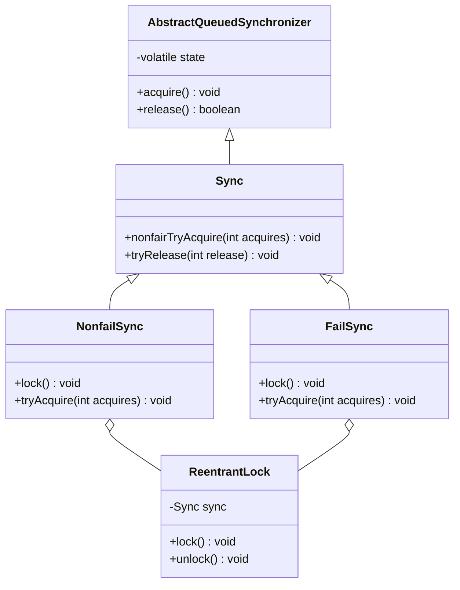
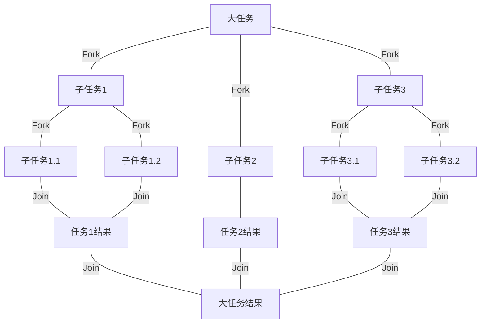
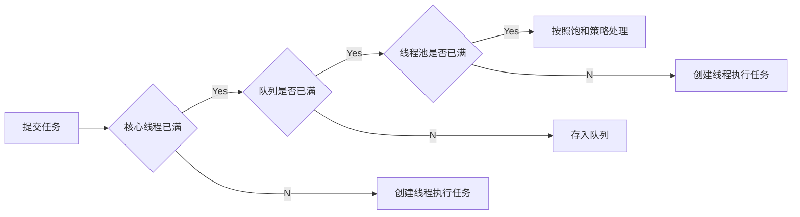

# Java多线程

本文基于《Java并发编程的艺术》

## 并发编程的挑战


## Java并发机制的底层实现原理

### volatile的应用

#### 定义和实现原理

`volatile`是如何来保证可见性的呢？让我们在X86处理器下通过工具获取JIT编译器生成的汇编指令来查看对`volatile`进行写操作时CPU会做什么事情。

`Java`代码如下。

```java
instance = new Singleton();//  instance 是 volatile 变量
```
转变成汇编代码，如下。
```assembly
0x01a3de1d: movb $0×0,0×1104800(%esi);0x01a3de24: lock addl $0×0,(%esp);
```

#### `Lock`前缀的指令在多核处理器下会引发了两件事情

**`Lock`前缀指令会引起处理器缓存回写到内存**
这个涉及到处理器的硬件实现。和代码无关。有的是锁总线，锁总线当前线程会独占共享内存；有的是锁缓存。

**一个处理器的缓存回写到内存会导致其他处理器的缓存无效**

`IA-32`处理器和`Intel 64`处理器使用 MESI（修改、独占、共享、无效）控制协议去维护内部缓存和其他处理器缓存的一致性。

### `synchronized`的实现原理和优化

`java`中的每一个对象都可以作为锁，主要有这三种

- 对于普通方法，锁是当前实例对象。
- 对于静态同步方法，锁是当前类的Class对象
- 对于同步块方法，锁是`synchronized`括号里的对象

#### 将缓存数据刷回主存

**离开一个`synchronized`块会导致当前线程所有写入到缓存的数据刷新，进入一个`synchronized`块会导致所有可变数据重新从主存获取。**

#### 锁

级别从低到高：无锁，偏向锁，轻量锁，重量锁。锁的状态会随着竞争情况逐渐升级。但不能降级。


| 锁       | 优点                                                         | 缺点                                           | 使用场景                             |
| -------- | ------------------------------------------------------------ | ---------------------------------------------- | ------------------------------------ |
| 偏向锁   | 加锁和解锁不需要额外的消耗，和执行非同步方法相比仅存在纳秒级别的差距 | 如果线程间存在锁竞争，会代理额外的锁撤销的消耗 | 适用于只有一个线程访问同步语块       |
| 轻量级锁 | 竞争的线程不会阻塞，而是自旋等待。提高了程序的响应速度       | 如果始终得不到锁竞争的线程，使用自旋会消耗CPU  | 追求响应时间，同步语块执行速度非常快 |
| 重量级锁 | 线程竞争不适用线程，不会消耗CPU                              | 线程阻塞，响应时间缓慢                         | 追求吞吐量，同步语块执行速度慢       |


## `Java`内存模型

### 多线程通信 JMM


### 指令重排序

- 编译器优化的重排序，编译器在不改变单线程程序执行语义的情况下，可以重新安排语句的执行顺序。

- 指令并行的重排序。指令级并行的重排序。现代处理器采用了指令级并行技术（ `Instruction-LevelParallelism, ILP`）来将多条指令重叠执行。如果不存在数据依赖性，处理器可以改变语句对应机器指令的执行顺序。

- 内存系统的重排序。由于处理器使用缓存和读写缓冲区，这使得加载和存储操作看上去可能是在乱序执行。

  ```mermaid
  graph LR
  源代码-->1.编译器优化重排序-->2.指令并行的重排序-->3.内存系统重排序-->最终执行的指令
  ```

  上述的1属于编译器重排序，2和 3属于处理器重排序。这些重排序可能会导致多线程程序出现内存可见性问题。对于编译器，JMM的编译器重排序规则会禁止特定类型的编译器重排序（不是所有的编译器重排序都要禁止）。对于处理器重排序，JMM的处理器重排序规则会要求 Java编译器在生成指令序列时，插入特定类型的内存屏障`Memory Barriers`， Intel称之为 `Memory Fence`）指令，通过内存屏障指令来禁止特定类型的处理器重排序。

**JMM属于语言级的内存模型**，它确保在不同的编译器和不同的处理器平台之上，通过禁止特定类型的编译器重排序和处理器重排序，为 程序员提供一致的内存可见性保证 。

### `volatile`的内存语义

`volatile`变量自身具有下列特性

- 可见性，对一个`volatile`变量的读，总是能看到（任意线程）对这个`volatile`变量最后的写入。
- ~~原子性~~ ，对任意单个`volatile`变量的读/写具有原子性，但类似于`volatile++`这种复合操作不具有原子性。

#### volatile重排序规则

- 当**第二个**操作是`volatile`写的时候，不管第一个操作是什么，都不能重排序。这个规则确保`volatile`写之前的操作不会被编译器重排序到`volatile`写之后。
- 当**第一个**操作是`volatile`读时，不管第二个操作是什么，都不能重排序。这个规则确保`volatile`读之后的操作不会被编译器重排序到`volatile`读之前。
- 第一个操作是`volatile`写，第二个操作时`volatile`读时，不能重排序。

为了实现`volatile`的内存语义，编译器在生成字节码时，会在

### 锁的内存语义

以`JUC`包的`ReentrantLock`作为例子。



##### 对公平锁和给公平锁的内存语义的总结

- 公平锁和非公平锁进行释放时，最后都要写一个`volatile`的变量`state`
- 公平锁获取时，首先会去读`volatile`变量`state`
- 非公平锁获取时，首先会用`CAS`更新`volatile`变量，这个操作同时具有`volatile`读和`volatile`写的内存语义

锁释放和锁获取至少有以下两种方式

- 利用`volatile`变量的读-写锁具有的内存语义
- 利用`CAS`所附带的`volatile`读和`volatile`写的内存语义

### final的内存语义

两个重排序规则

- 在构造函数内对一个`final`域的写入，与随后把这个构造对象的引用赋值给一个引用变量，这两个操作之间不能重排序。
- 初次读一个包含`final`域的对象的引用，与随后初次读这个`final`域，这两个操作之间不能重排序。

读`final`域的重排序规则是，在一个线程中，初次读对象引用与初次读该对象包含的`final`域，JMM禁止处理器重排序这两个操作（注意，这个规则仅仅针对处理器）。编译器会在读`final`域操作的前面插入一个`LoadLoad`屏障。

### happens-before

在JMM中，如果一个操作执行的结果需要对另一个操作可见，那么这两个操作之间必须要存在`happens-befor`e关系。这里提到的两个操作既可以是在一个线程之内，也可以是在不同线程之间。

*《JSR-133:JavaMemoryModelandThreadSpecification》*定义了如下`happens-before`规则。

1. 程序顺序规则：一个线程中的每个操作，`happens-before`于该线程中的任意后续操作。
2. 监视器锁规则：对一个锁的解锁，`happens-before`于随后对这个锁的加锁。
3. `volatile`变量规则：对一个`volatile`域的写，`happens-before`于任意后续对这个`volatile`域的读。
4. 传递性：如果`A happens-before B`，且`B happens-before C`，那么`A happens-before C`。
5. `start()`规则：如果线程A执行操作`ThreadB.start()`（启动线程B），那么A线程的`ThreadB.start()`操作`happens-before`于线程B中的任意操作。
6. `join()`规则：如果线程A执行操作`ThreadB.join()`并成功返回，那么线程B中的任意操作`happens-before`于线程A从`ThreadB.join()`操作成功返回。

### 双重检查锁定，double-checked locking

```java
public class Singleton {
    // volatile 关键字保证，当uniqueInstance被实例时，多个线程能正确的获取uniqueInstance变量
    private volatile static Singleton uniqueInstance;
    private Singleton() {}
    public static Singleton getInstance() {
        // 检查实例，如果不存在就进入同步块
        if (uniqueInstance == null) {
            // 注意，只有第一次才彻底执行这里的代码
            synchronized(Singleton.class) {
                // 进入同步块后，再次检查，如果还是null才创建。
                if (uniqueInstance == null) {
                    uniqueInstance = new Singleton();
                }
            }
        }
        return uniqueInstance;
    }
}
```

### 延迟初始化

```java
class InstanceFactory {
    private static class InstanceHolder {
        public static Instance instance = new Instance();
    }
    public static Instance getInstance() {
        // 这里将导致 InstanceHolder 类被加载并初始化
        return InstanceHolder.instance;
    }
}
```


## Java并发编程基础

Java线程状态

| 状态名称       | 说明                                       |
| -------------- | ------------------------------------------ |
| `new`          | 创建完成，但是还没有执行`start()`方法      |
| `runnable`     | 运行中                                     |
| `blocked`      | 堵塞，标识线程被锁堵塞着                   |
| `waiting`      | 等待其他线程做出一些特定操作，如通知或中断 |
| `time_waiting` | 超时等待状态，它是可以在指定时间自行返回的 |
| `terminated`   | 终止状态，线程执行完毕                     |

## Java中的锁

### Lock接口

> 定义了锁获取和释放的一系列操作，并能提供`synchronized`关键字不具备的特质

- **尝试非阻塞地获取锁**：当前线程尝试获取锁，如果这一时刻锁没有被其他线程获取到，则成功获取并持有锁。
- **能被中断地获取锁**：与`synchronized`不同，获取锁的线程能够响应中断，当获取到锁的线程被中断时，中断异常将会被抛出，同时锁会被释放。
- **超时获取锁🔐**：在指定的时间之前获取锁，如果截止时间到了仍旧无法获得锁，则返回。

### 队列同步器AQS

`AbstractQueuedSynchronizer`又被称为`AQS`。提供模板方法，其中`FailSync`和`nonFailSync`等都是基于AQS实现的。

### 能够覆盖的模板方法。

```java
public class CustomLock extends AbstractQueuedSynchronizer {

    @Override
    protected boolean tryAcquire(int arg) {
        return super.tryAcquire(arg);
    }

    @Override
    protected boolean tryRelease(int arg) {
        return super.tryRelease(arg);
    }

    @Override
    protected int tryAcquireShared(int arg) {
        return super.tryAcquireShared(arg);
    }

    @Override
    protected boolean tryReleaseShared(int arg) {
        return super.tryReleaseShared(arg);
    }

    @Override
    protected boolean isHeldExclusively() {
        return super.isHeldExclusively();
    }
}
```

### `ReentrantLock`

#### 使用

```java
int count = 1;
public void increment() {
    // 非公平锁
    Lock lock = new ReentrantLock();
    // 公平锁
    // lock = new ReentrantLock(true);
    lock.lock();
    try {
        count++;
        System.out.println(count);
    } finally {
        // 最后释放锁
        lock.unlock();
    }
}
```

重入锁和`synchronized`关键字的区别

- 重入锁能够超时获取锁，并触发中断
- 重入锁判断的是`AQS`里的`state`字段，而`synchronized`判断的是对象头。两者都避免锁的获取不在用户态和内核态之间进行切换
- `synchronized`是**非公平锁**，如果要实现公平锁，只能使用`ReentrantLock`
- `synchronized`关键字实现了偏向锁，自旋锁，性能上和`ReentrantLock`基本一样
- `ReentrantLock`提供了`newCondition`方法，可以通过`Condition.await()`和`Condition.signal()`方法来阻塞唤醒指定的线程或是线程组

#### 公平锁和非公平锁的区别

- 公平锁会在有新的线程进来的时候，首先判断下队列中是否有线程在等待，如果有，则加入队列

- 非公平锁会先尝试获取锁，如果获取失败，就加入队列。
- 性能上，公平锁的性能会比非公平锁低，因为公平锁会导致过多的线程切换，影响吞吐率。但是非公平锁可能会导致**线程饥饿**的问题

### `ReentrantReadWriteLock`

`ReentrantLock`和`synchronized`关键字都是**排他锁（独占锁）**，这些锁在同一时刻只允许一个线程访问，而读写锁（`ReentrantReadWriteLock`）可以允许多个线程访问。**读锁是共享锁，写锁是排他锁。读锁和写锁互斥。**在性能上`ReentrantReadWriteLock`比`ReentrantLock`好。

TODO

### `StampedLock`

`stamped`印有印章的印记，**不是重入锁**🔒

`ReentrantReadWriteLock`使得多个读线程同时持有读锁（只要写锁未被占用），而写锁是独占的。

但是，读写锁如果使用不当，很容易产生“饥饿”问题：

比如在读线程非常多，写线程很少的情况下，很容易导致写线程“饥饿”，虽然使用“公平”策略可以一定程度上缓解这个问题，但是“公平”策略是以牺牲系统吞吐量为代价的。

#### StampedLock的特点

`try`系列获取锁的函数，当获取锁失败后会返回为0的`stamp`值。当调用释放锁和转换锁的方法时候需要传入获取锁时候返回的`stamp`值。

`StampedLockd`的内部实现是基于`CLH`锁的，`CLH`锁原理：锁维护着一个等待线程队列，所有申请锁且失败的线程都记录在队列。一个节点代表一个线程，

保存着一个标记位`locked`,用以判断当前线程是否已经释放锁。当一个线程试图获取锁时，从队列尾节点作为前序节点，循环判断所有的前序节点是否已经成功释放锁。

[JDK8中新增的StampedLock](https://cloud.tencent.com/developer/article/1470988)

### `LockSupport`

用于阻塞或唤醒线程

用法

```java
 // 阻塞当前线程
 LockSupport.park();
 // 线程的功能，其中参数 blocker是用来标识当前线程在等待的对象，该对象主要用于问题排查和系统监控。
 LockSupport.park(this);
 // 等待的超时时间，单位毫秒
 LockSupport.parkNanos(1000);
 // deadline是绝对时间，毫秒
 LockSupport.parkUntil(System.currentTimeMillis() + 1000);
 // 唤醒线程
 LockSupport.unpark(Thread.currentThread());
```

### `Condition`

`Condition`是`Lock#newCondition`创建出来的

```java
Lock lock = new ReentrantLock();
Condition condition = lock.newCondition();
public void conditionWait()throws InterruptedException{
    lock.lock();
    try {
        condition.await();
    }finally {
        lock.unlock();
    }
}
public void conditionSignal(){
    lock.lock();
    try {
        condition.signal();
    }finally {
        lock.unlock();
    }
}
```

TODO

## Java并发容器和框架

### `ConcurrentHashMap`

TODO

### Java中的阻塞队列

阻塞队列是一个支持阻塞的插入和移除方法的队列：

- 支持阻塞的插入方法：当队列满时，阻塞插入元素的线程，直到队列中有元素被移除
- 支持阻塞的移除方法：当队列空时，获取队列元素的线程会一直等待，知道取得队列中的元素

#### `ArrayBlockingQueue`数组结构组成的有界阻塞队列

按照FIFO的原则对元素进行排序。可以选择是否保证队列的公平性，访问者的公平性是基于可重入锁`ReentrantLock`实现的

```java
ArrayBlockingQueue fairQueue = new ArrayBlockingQueue(100, true);
```

#### `LinkedBlockingQueue`链表实现的有界阻塞队列

默认长度并且是最大长度为`Integer.MAX_VALUE`。**FIFO**

#### `PriorityBlockingQueue`支持优先级的无界阻塞队列，数组实现

默认情况下元素按照升序排序。也可以自定义类实现`compareTo()`方法来指定元素排序规则，或者在初始化`PriorityBlockingQueue`时，指定`Comparator`来对元素进行排序。

#### `DelayQueue`支持延时获取元素的无界阻塞队列

是`PriorityQueue`的子类

#### `SynchronousQueue`不存储元素的阻塞队列

每一个`put`操作必须等待一个`take`操作，否则不能继续添加元素。可以把`SynchronousQueue`看成传球手，负责把生产者线程处理的数据直接给消费者线程。

```java
public SynchronousQueue(boolean fair) {
    transferer = fair ? new TransferQueue<E>() : new TransferStack<E>();
}
```

#### LinkedTransferQueue链表实现的无界阻塞队列

相比于其他阻塞队列，`LinkedTransferQueue`多了`tryTransfer`和`transfer`方法。

- `transfer`方法

  如果当前有消费者正在等待接收元素（使用`take()`或`poll()`方法时），`transfer()`方法可以把生产者传入的元素立刻`transfer`给消费者。如果没有消费者在等待接收元素，`transfer`会将元素放在队列的`tail`节点，**并等待被消费者消费了才返回**。

- `tryTransfer`方法

  `tryTransfer`方法是用来试探生产者传入的元素是否能直接传给消费者。如果没有消费者等待接收元素，则返回`false`。和`transfer`方法的区别是`tryTransfer`方法无论消费者是否接收，方法立即返回，而`transfer`方法是必须等到消费者消费了才返回。

#### `LinkedBlockingDueue`链表实现的双向阻塞队列

`LinkedBlockingDeque`是一个由链表结构组成的双向阻塞队列。所谓双向队列指的是可以从队列的两端插入和移出元素。双向队列因为多了一个操作队列的入口，在多线程同时入队时，也就减少了一半的竞争。相比其他的阻塞队列，`LinkedBlockingDeque`多了`addFirst、addLast、offerFirst、offerLast、peekFirst`和`peekLast`等方法，以`First`单词结尾的方法，表示插入、获取（`peek`）或移除双端队列的第一个元素。以Last单词结尾的方法，表示插入、获取或移除双端队列的最后一个元素。另外，插入方法`add`等同于`addLast`，移除方法`remove`等效于`removeFirst`。但是`take`方法却等同于`takeFirst`，不知道是不是JDK的bug，使用时还是用带有First和`Last`后缀的方法更清楚。在初始化`LinkedBlockingDeque`时可以设置容量防止其过度膨胀。

另外，双向阻塞队列可以运用在“工作窃取”模式中。

#### `ConcurrentLinkendQueue`

TODO

### Fork/Join框架

`Fork/Join`框架是Java7提供的一个用于并行执行任务的框架，是一个把大任务分割成若干个小任务，最终汇总每个小任务结果后得到大任务结果的框架。



#### 工作窃取算法

双向队列，被窃取的任务线程永远从双向队列的头部拿任务执行，而窃取任务的线程永远从双向队列的尾部拿任务执行。

#### 使用

```java
@AllArgsConstructor
public class CountTask extends RecursiveTask<Integer> {
    private static final int threshold = 2;
    private final int start;
    private final int end;

    @Override
    protected Integer compute() {
        int sum = 0;
        if (end - start <= threshold) {
            for (int i = start; i <= end; i++) {
                sum += i;
            }
        } else {
            int mid = (end + start) / 2;
            CountTask t1 = new CountTask(start, mid);
            CountTask t2 = new CountTask(mid + 1, end);
            t1.fork();
            t2.fork();
            sum = t1.join() + t2.join();
        }
        return sum;
    }

    public static void main(String[] args) throws ExecutionException, InterruptedException {
        ForkJoinPool forkJoinPool = new ForkJoinPool(10);
        ForkJoinTask<Integer> submit = forkJoinPool.submit(new CountTask(1, 99));
        Integer ret = submit.get();
        System.out.println(ret);
    }
}
```


## 13个原子操作类

### 基本类型

#### AtomicBoolean

#### AtomicInteger

#### AtomicLong

### 数组

#### AtomicIntegerArray

#### AtomicReferenceArray

#### AtomicLongArray

### 引用类型

#### AtomicMarkableReference
#### AtomicReference

#### AtomicStampedReference

### 更新字段

#### AtomicLongFieldUpdater

#### AtomicIntegerFieldUpdater

#### AtomicReferenceFieldUpdater


## 并发工具类

### 等待多线程完成的`CountDownLatch`

`CountDownLatch`的构造函数接收一个`int`参数作为计数器，表示等待N个点完成。当调用`countDown`方法时，计数器就会减一。 这里的N个点，可以是N个线程，也可以是1个线程里的N个执行步骤。例如解析`Excel`的sheet。

#### 使用

```java
public class CountDownLatchTester {
    static CountDownLatch countDownLatch = new CountDownLatch(3);
    public static void main(String[] args) throws InterruptedException {
        countDownLatch.countDown();
        new Thread(() -> {
            countDownLatch.countDown();
            try {
                Thread.sleep(3000);
            } catch (InterruptedException e) {
                e.printStackTrace();
            } finally {
                System.out.println("线程内打印");
                countDownLatch.countDown();
            }
        }).start();
        countDownLatch.await();
    }
}
```

### 同步屏障`CyclicBarrier`

`CyclicBarrier`的字面意思是可循环使用（`Cyclic`）的屏障（`Barrier`）。主要作用是让一组线程到达一个屏障（也可以叫同步点）时被阻塞，直到最后一个线程（包括主线程）到达屏障时，屏障才会开门，所有被拦截的线程才会继续运行。

和`CountDownLatch`相比，`CyclicBarrier`可以被重复使用，还提供一些了解阻塞线程信息的方法。

#### 使用

```java
public class CyclicBarrierTester {
    public static void main(String[] args) throws Exception {
        CyclicBarrier cyclicBarrier = new CyclicBarrier(2);
        new Thread(() -> {
            try {
                System.out.println("sub thread");
                Thread.sleep(3000);
                cyclicBarrier.await();
                System.out.println("sub thread were finished");
            } catch (InterruptedException | BrokenBarrierException e) {
                e.printStackTrace();
            }
        }).start();
        // 重置方法
        // cyclicBarrier.reset();
        // 获取阻塞的线程数量的方法
        // cyclicBarrier.getNumberWaiting();
        cyclicBarrier.await();
        System.out.println("sub thread were finished");
    }
}
```

### 控制并发线程数`Semaphore`

`Semaphore`信号量。是用来控制同时访问特定资源的线程数量，它通过协调各个线程，以保证合理的使用公共资源。

### 使用

`Semaphore`可以用来做流量控制。加入有一个需求，要读取几万个文件的数据，因为都是IO密集型任务，我们可以启动几十个线程并发的去读取，但是如果读到内存后，还需要存储到数据库中，而数据库连接数只有10个，这时我们必须控制只有10个线程能够获取数据库链接来保存数据。

```java
public class SemaphoreTester {
    private static final int THREAD_COUNT = 30;
    static ExecutorService executorService = Executors.newFixedThreadPool(THREAD_COUNT);
    // 最后只能有10个线程获取到数据库连接池
    private static final Semaphore semaphore = new Semaphore(10);

    public static void main(String[] args) {
        for (int i = 0; i < THREAD_COUNT; i++) {
            executorService.submit(() -> {
                try {
                    semaphore.acquire();
                    System.out.println("模拟插入数据到数据库");
                    Thread.sleep(3000);
                } catch (InterruptedException e) {
                    e.printStackTrace();
                } finally {
                    semaphore.release();
                }
            });
        }
        // 会等待所有线程执行完成才会关闭
        executorService.shutdown();
    }
}
```

### 线程间交换数据的`Exchanger`

`Exchanger`（交换者）是一个用于线程间协作，进行数据交换的工具类。它提供一个同步点，在这个同步点，两个线程可以交换彼此的数据。这两个线程通过`exchange`方法**交换数据**。

```java
public class ExchangerTester {
    static ExecutorService executorService = Executors.newFixedThreadPool(2);
    static Exchanger<String> exchanger = new Exchanger<>();

    public static void main(String[] args) {
        executorService.submit(() -> {
            try {
                String a = exchanger.exchange("wdnmd");
                System.out.println("first thread: " + a);
            } catch (InterruptedException e) {
                e.printStackTrace();
            }
        });
        executorService.submit(() -> {
            try {
                String c = exchanger.exchange("C");
                System.out.println("second thread: " + c);
            } catch (InterruptedException e) {
                e.printStackTrace();
            }
        });
        // 会等待所有线程执行完成才会关闭
        executorService.shutdown();
    }
    // second thread: wdnmd
    // first thread: C
}
```


## 线程池

### 线程池的好处

1. 降低资源消耗。通过重复利用已创建的线程降低线程创建和销毁造成的消耗
2. 提高响应速度。当任务到达时，任务可以不需要等到创建线程就能立即执行
3. 提高线程的可管理性。线程是稀缺资源，如果无限制的创建，不仅会消耗系统资源，还会降低系统的稳定性，使用线程池可以进行统一分配、调优和监控

### 线程池的主要处理流程




## `Executor`框架

在`HotSpot VM`的线程模型中，`Java`线程（`java.lang.Thread`）被一对一映射为本地操作系统线程。

### `Executor`框架的结构

`Executor`框架主要由三大部分组成

- 任务。包括被执行任务需要实现的接口：`Runnable`接口或`Callable`接口
- 任务的执行。包括任务执行机制的核心接口`Executor`，以及继承自`Executor`的`ExecutorService`接口。`Executor`有两个关键类实现了`ExecutorService`接口（`ThreadPoolExecutor`和`ScheduledTreadPoolExecutor`）。
- 异步计算的结果。包括接口`Future`和实现类`FutureTask`

相关类和接口简介

- `TheadPoolExecutor`是线程池的核心实现类，用来执行被提交的任务。

- `ScheduledThreadPoolExecutor`，可以在给定的延迟后运行命令，或定期执行命令。比Timer更灵活，且功能强大。

- `Callable`和`Runnable`的不同在于，`Callable`可以返回数据给主线程。而`Runnable`只能返回给定的结果。所有提交的`Runnable`接口的实现，最后在创建`FutureTask`的时候，都会被转为`Callable`

  ```java
  <T> Future<T> submit(Callable<T> task);// ExecutorService中对于submit callable任务的定义
  <T> Future<T> submit(Runnable task, T result);
  ```

### `ScheduledThreadPoolExecutor`

#### 相对于`ThreadPoolExecutor`的区别

1. 使用`DelayQueue`作为任务队列
2. 获取任务的方式不同
3. 执行周期任务后，增加了额外操作

#### 实现

`ScheduledThreadPoolExecutor`会把待调度的`ScheduledFurtureTask`放到一个`DelayQueue`中。

```java
class ScheduledFutureTask<V> extends FutureTask<V> implements RunnableScheduledFuture<V> {
    // 添加到队列中的序号
    private final long sequenceNumber;
    // 这个任务将要执行的具体时间
    private long time;
    // 表示任务执行的间隔
    private final long period;
}
```

`DelayQueue`继承了`PriorityQueue`，

> 排序规则，order by time asc，order by sequenceNumber asc

对`DelayQueue`的`take()`和`add()`都要加锁。

**`task`**

1. 获取`Lock`
2. 获取周期任务
   - 如果队列为空，当前线程到`Condition`中`await`。否则执行下一条判断
   - 如果头元素的`time`比当前时间大，到`Condition`中`await`。否则执行下一条
   - 获取所有`time`小于等于当前时间的`FurtureTask`，唤醒`Condition`中等待的线程，并交付`FutureTask`执行。
3. 释放`Lock`

**`add`**

1. 获取`Lock`
2. 添加任务，如果任务满足执行条件，则唤醒`Condition`中等待的线程，交付执行。
3. 释放`Lock`

### `FutureTask`

`FutureTask`除了实现`Future`接口外，还实现了接口`Runnable`。因此`FutureTask`可以交给`Executor`执行，也可以由调用线程直接执行（强转后调用`FutureTask.run()`）。

`FutureTask`有三种状态

1. 未启动，`FutureTask.run()`未执行之前。
2. 已启动，`FutureTask.run()`的执行过程中。
3. 已完成，可以是正常结束，也可以是取消`Future.cancel(boolean mayInterruptIfRunning)`，也可以是因为抛出异常而结束。

> 当`Future`处于未启动或已启动状态时，执行`Future.get()`方法将会导致调用线程阻塞；当`Future`处于已完成状态时，执行`Future.get()`方法将会导致调用线程立即返回结果或抛出异常。


## 实战

### 线上问题定位


### 性能测试

