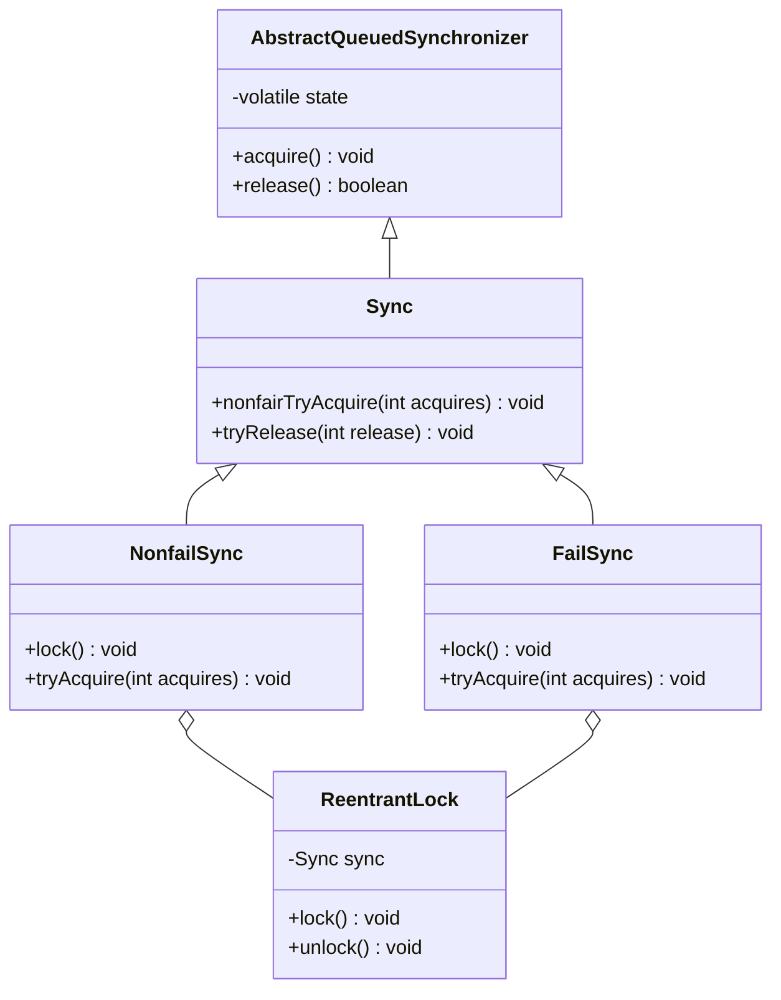

# Java多线程

本文基于《Java并发编程的艺术》

## 并发编程的挑战


## Java并发机制的底层实现原理

### volatile的应用

#### 定义和实现原理

volatile是如何来保 证 可 见 性的呢？ 让 我 们 在 X86处 理器下通 过 工具 获 取 JIT编译 器
生成的 汇编 指令来 查 看 对 volatile进 行写操作 时 CPU会做什么事情。
Java代 码 如下。
```java
instance = new Singleton();//  instance 是 volatile 变量
```
转变成汇编代码，如下。
```assembly
0x01a3de1d: movb $0×0,0×1104800(%esi);0x01a3de24: lock addl $0×0,(%esp);
```

#### Lock前缀的指令在多核处理器下会引发了两件事情

**Lock前缀指令会引起处理器缓存回写到内存**
这个涉及到处理器的硬件实现。和代码无关。有的是锁总线，锁总线当前线程会独占共享内存；有的是锁缓存。

**一个处理器的缓存回写到内存会导致其他处理器的缓存无效**

IA-32处理器和Intel 64处理器使用 MESI（修改、独占、共享、无效）控制协议去维护内部缓存和其他处理器缓存的一致性。

### synchronized的实现原理和优化

java中的每一个对象都可以作为锁，主要有这三种

- 对于普通方法，锁是当前实例对象。
- 对于静态同步方法，锁是当前类的Class对象
- 对于同步块方法，锁是`synchronized`括号里的对象

#### 将缓存数据刷回主存

**离开一个synchronized块会导致当前线程所有写入到缓存的数据刷新，进入一个synchronized块会导致所有可变数据重新从主存获取。**

#### 锁

级别从低到高：无锁，偏向锁，轻量锁，重量锁。锁的状态会随着竞争情况逐渐升级。但不能降级。


| 锁       | 优点                                                         | 缺点                                           | 使用场景                             |
| -------- | ------------------------------------------------------------ | ---------------------------------------------- | ------------------------------------ |
| 偏向锁   | 加锁和解锁不需要额外的消耗，和执行非同步方法相比仅存在纳秒级别的差距 | 如果线程间存在锁竞争，会代理额外的锁撤销的消耗 | 适用于只有一个线程访问同步语块       |
| 轻量级锁 | 竞争的线程不会阻塞，而是自旋等待。提高了程序的响应速度       | 如果始终得不到锁竞争的线程，使用自旋会消耗CPU  | 追求响应时间，同步语块执行速度非常快 |
| 重量级锁 | 线程竞争不适用线程，不会消耗CPU                              | 线程阻塞，响应时间缓慢                         | 追求吞吐量，同步语块执行速度慢       |


## Java内存模型

### 多线程通信 JMM


### 指令重排序

- 编译器优化的重排序，编译器在不改变单线程程序执行语义的情况下，可以重新安排语句的执行顺序。

- 指令并行的重排序。指令级并行的重排序。现代处理器采用了指令级并行技术（ Instruction-LevelParallelism, ILP）来将多条指令重叠执行。如果不存在数据依赖性，处理器可以改变语句对应机器指令的执行顺序。

- 内存系统的重排序。由于处理器使用缓存和读写缓冲区，这使得加载和存储操作看上去可能是在乱序执行。

  ```mermaid
  graph LR
  源代码-->1.编译器优化重排序-->2.指令并行的重排序-->3.内存系统重排序-->最终执行的指令
  ```

  上述的1属于编译器重排序，2和 3属于处理器重排序。这些重排序可能会导致多线程程序出现内存可见性问题。对于编译器，JMM的编译器重排序规则会禁止特定类型的编译器重排序（不是所有的编译器重排序都要禁止）。对于处理器重排序，JMM的处理器重排序规则会要求 Java编译器在生成指令序列时，插入特定类型的内存屏障Memory Barriers Intel称之为 Memory Fence）指令，通过内存屏障指令来禁止特定类型的处理器重排序。

**JMM属于语言级的内存模型**，它确保在不同的编译器和不同的处理器平台之上，通过禁止特定类型的编译器重排序和处理器重排序，为 程序员提供一致的内存可见性保证 。

### volatile的内存语义

volatile变量自身具有下列特性

- 可见性，对一个volatile变量的读，总是能看到（任意线程）对这个volatile变量最后的写入。
- ~~原子性~~ ，对任意单个volatile变量的读/写具有原子性，但类似于`volatile++`这种复合操作不具有原子性。

#### volatile重排序规则

- 当**第二个**操作是volatile写的时候，不管第一个操作是什么，都不能重排序。这个规则确保volatile写之前的操作不会被编译器重排序到volatile写之后。
- 当**第一个**操作是volatile读时，不管第二个操作是什么，都不能重排序。这个规则确保volatile读之后的操作不会被编译器重排序到volatile读之前。
- 第一个操作是volatile写，第二个操作时volatile读时，不能重排序。

为了实现volatile的内存语义，编译器在生成字节码时，会在

### 锁的内存语义

以JUC包的`ReentrantLock`作为例子。



##### 对公平锁和给公平锁的内存语义的总结

- 公平锁和非公平锁进行释放时，最后都要写一个volatile的变量state
- 公平锁获取时，首先会去读volatile变量state
- 非公平锁获取时，首先会用CAS更新volatile变量，这个操作同时具有volatile读和volatile写的内存语义

锁释放和锁获取至少有以下两种方式

- 利用volatile变量的读-写锁具有的内存语义
- 利用CAS所附带的volatile读和volatile写的内存语义

### final的内存语义

两个重排序规则

- 在构造函数内对一个final域的写入，与随后把这个构造对象的引用赋值给一个引用变量，这两个操作之间不能重排序。
- 初次读一个包含final域的对象的引用，与随后初次读这个final域，这两个操作之间不能重排序。

读final域的重排序规则是，在一个线程中，初次读对象引用与初次读该对象包含的final域，JMM禁止处理器重排序这两个操作（注意，这个规则仅仅针对处理器）。编译器会在读final域操作的前面插入一个LoadLoad屏障。


### happens-before

在JMM中，如果一个操作执行的结果需要对另一个操作可见，那么这两个操作之间必须要存在happens-before关系。这里提到的两个操作既可以是在一个线程之内，也可以是在不同线程之间。

《JSR-133:JavaMemoryModelandThreadSpecification》定义了如下happens-before规则。

1. 程序顺序规则：一个线程中的每个操作，happens-before于该线程中的任意后续操作。
2. 监视器锁规则：对一个锁的解锁，happens-before于随后对这个锁的加锁。
3. volatile变量规则：对一个volatile域的写，happens-before于任意后续对这个volatile域的读。
4. 传递性：如果Ahappens-beforeB，且Bhappens-beforeC，那么Ahappens-beforeC。
5. start()规则：如果线程A执行操作ThreadB.start()（启动线程B），那么A线程的ThreadB.start()操作happens-before于线程B中的任意操作。
6. join()规则：如果线程A执行操作ThreadB.join()并成功返回，那么线程B中的任意操作happens-before于线程A从ThreadB.join()操作成功返回。

### 双重检查锁定，double-checked locking

```java
public class Singleton {
    // volatile 关键字保证，当uniqueInstance被实例时，多个线程能正确的获取uniqueInstance变量
    private volatile static Singleton uniqueInstance;
    private Singleton() {}
    public static Singleton getInstance() {
        // 检查实例，如果不存在就进入同步块
        if (uniqueInstance == null) {
            // 注意，只有第一次才彻底执行这里的代码
            synchronized(Singleton.class) {
                // 进入同步块后，再次检查，如果还是null才创建。
                if (uniqueInstance == null) {
                    uniqueInstance = new Singleton();
                }
            }
        }
        return uniqueInstance;
    }
}
```

### 延迟初始化

```java
class InstanceFactory {
    private static class InstanceHolder {
        public static Instance instance = new Instance();
    }
    public static Instance getInstance() {
        // 这里将导致 InstanceHolder 类被加载并初始化
        return InstanceHolder.instance;
    }
}
```


## Java并发编程基础

Java线程状态

| 状态名称     | 说明                                       |
| ------------ | ------------------------------------------ |
| new          | 创建完成，但是还没有执行start()方法        |
| runnable     | 运行中                                     |
| blocked      | 堵塞，标识线程被锁堵塞着                   |
| waitting     | 等待其他线程做出一些特定操作，如通知或中断 |
| time_waiting | 超时等待状态，它是可以在指定时间自行返回的 |
| terminated   | 终止状态，线程执行完毕                     |

## Java中的锁

### Lock接口

> 定义了锁获取和释放的一系列操作，并能提供`synchronized`关键字不具备的特质

- **尝试非阻塞地获取锁**：当前线程尝试获取锁，如果这一时刻锁没有被其他线程获取到，则成功获取并持有锁。
- **能被中断地获取锁**：与`synchronized`不同，获取锁的线程能够响应中断，当获取到锁的线程被中断时，中断异常将会被抛出，同时锁会被释放。
- **超时获取锁🔐**：在指定的时间之前获取锁，如果截止时间到了仍旧无法获得锁，则返回。


### 队列同步器AQS

`AbstractQueuedSynchronizer`又被称为`AQS`。提供模板方法，其中`FailSync`和`nonFailSync`等都是基于AQS实现的。

### 能够覆盖的模板方法。

```java
public class CustomLock extends AbstractQueuedSynchronizer {

    @Override
    protected boolean tryAcquire(int arg) {
        return super.tryAcquire(arg);
    }

    @Override
    protected boolean tryRelease(int arg) {
        return super.tryRelease(arg);
    }

    @Override
    protected int tryAcquireShared(int arg) {
        return super.tryAcquireShared(arg);
    }

    @Override
    protected boolean tryReleaseShared(int arg) {
        return super.tryReleaseShared(arg);
    }

    @Override
    protected boolean isHeldExclusively() {
        return super.isHeldExclusively();
    }
}
```


### ReentrantLock

#### 使用

```java
int count = 1;
public void increment() {
    // 非公平锁
    Lock lock = new ReentrantLock();
    // 公平锁
    // lock = new ReentrantLock(true);
    lock.lock();
    try {
        count++;
        System.out.println(count);
    } finally {
        // 最后释放锁
        lock.unlock();
    }
}
```

重入锁和`synchronized`关键字的区别

- 重入锁能够超时获取锁，并触发中断
- 重入锁判断的是AQS里的state字段，而`synchronized`判断的是对象头。两者都避免锁的获取不在用户态和内核态之间进行切换
- `synchronized`是**非公平锁**，如果要实现公平锁，只能使用`ReentrantLock`
- `synchronized`关键字实现了偏向锁，自旋锁，性能上和`ReentrantLock`基本一样
- `ReentrantLock`提供了`newCondition`方法，可以通过`Condition.await()`和`Condition.signal()`方法来阻塞唤醒指定的线程或是线程组

#### 公平锁和非公平锁的区别

- 公平锁会在有新的线程进来的时候，首先判断下队列中是否有线程在等待，如果有，则加入队列

- 非公平锁会先尝试获取锁，如果获取失败，就加入队列。
- 性能上，公平锁的性能会比非公平锁低，因为公平锁会导致过多的线程切换，影响吞吐率。但是非公平锁可能会导致**线程饥饿**的问题

### ReentrantReadWriteLock

`ReentrantLock`和`synchronized`关键字都是**排他锁（独占锁）**，这些锁在同一时刻只允许一个线程访问，而读写锁（`ReentrantReadWriteLock`）可以允许多个线程访问。**读锁是共享锁，写锁是排他锁。读锁和写锁互斥。**在性能上`ReentrantReadWriteLock`比`ReentrantLock`好。


### StampedLock

`stamped`印有印章的印记

ReentrantReadWriteLock使得多个读线程同时持有读锁（只要写锁未被占用），而写锁是独占的。

但是，读写锁如果使用不当，很容易产生“饥饿”问题：

比如在读线程非常多，写线程很少的情况下，很容易导致写线程“饥饿”，虽然使用“公平”策略可以一定程度上缓解这个问题，但是“公平”策略是以牺牲系统吞吐量为代价的。

#### StampedLock的特点

try系列获取锁的函数，当获取锁失败后会返回为0的stamp值。当调用释放锁和转换锁的方法时候需要传入获取锁时候返回的stamp值。

StampedLockd的内部实现是基于CLH锁的，CLH锁原理：锁维护着一个等待线程队列，所有申请锁且失败的线程都记录在队列。一个节点代表一个线程，

保存着一个标记位locked,用以判断当前线程是否已经释放锁。当一个线程试图获取锁时，从队列尾节点作为前序节点，循环判断所有的前序节点是否已经成功释放锁。

[JDK8中新增的StampedLock](https://cloud.tencent.com/developer/article/1470988)

### LockSupport

用于阻塞或唤醒线程

用法

```java
 // 阻塞当前线程
 LockSupport.park();
 // 线程的功能，其中参数 blocker是用来标识当前线程在等待的对象，该对象主要用于问题排查和系统监控。
 LockSupport.park(this);
 // 等待的超时时间，单位毫秒
 LockSupport.parkNanos(1000);
 // deadline是绝对时间，毫秒
 LockSupport.parkUntil(System.currentTimeMillis() + 1000);
 // 唤醒线程
 LockSupport.unpark(Thread.currentThread());
```

### Condition

Condition是`Lock#newCondition`创建出来的

```java
Lock lock = new ReentrantLock();
Condition condition = lock.newCondition();
public void conditionWait()throws InterruptedException{
    lock.lock();
    try {
        condition.await();
    }finally {
        lock.unlock();
    }
}
public void conditionSignal(){
    lock.lock();
    try {
        condition.signal();
    }finally {
        lock.unlock();
    }
}
```

## Java并发容器和框架

### ConcurrentHashMap


### ConcurrentLinkendQueue


## 13个原子操作类


## 并发工具类


## 线程池


## Executor框架