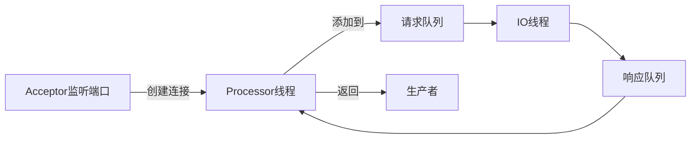

# Kafka
## 主题和分区

- 分区，每个topic有多个分区，每个分区的数据都不一样，每个分区可能不在同一台broker上
- 主题可以分为多个分区，并且可以在Kafka运行中增加分区
- 消息以追加的方式写入分区，然后以先入先出的顺序读取
- 由于一个主题可以包含多个分区，因此无法在整个主题范围内保证消息的顺序，但是可以保证消息在单个分区内的顺序。
- **如果消息是按照不同的键（hash）来写入分区的**，那么为已有的主题增加分区就会很困难

> 分区是不是越多越好？
>
> 单个broker对分区个数是有限制的，因为分区越多，占用的内存越多，完成首领选举需要的时间也越长

### broker和集群

- 单个broker接收来自生产者的消息，为消息设置偏移量（索引），并提交到磁盘保存
- 单个broker可以轻松处理数千个分区以及每秒百万级的消息量。

### 消息的保存

保存消息（在一定期限内），是Kafka的一个重要指标，Kafka broker默认的消息保存策略如下

- 保存一段时间（默认7天）
- 保存到一定大小的字节（默认1G）

> 只有超过部分才会被删除，并且每个主题都是可以设置不同的保存策略

### 多个集群中的消息复制

可以用官方提供的`mirrorMaker`来对多个Kafka集群的消息进行同步

## 生产者

### 发送消息有三种方式

#### 发送并忘记（fire and forgot）

将消息发送到服务器，但是并不关心是否到达。大多数情况下，消息会正常到达，因为 Kafka 是高可用的，而且生产者会自动尝试重发。不过，使用这种方式有时候也会丢失一些消息。

#### 同步发送

使用 `send()` 方法发送消息，它会返回一个 `Future` 对象，调用 `get()` 方法进行等待，就可以知道消息是否发送成功。

#### 异步发送

调用 `send()` 方法，并指定一个回调函数，服务器在返回响应时调用该函数。

**配置生产消息推送到broker成功的策略**，all表示主从都收到了消息。1表示只需要分区master收到就会确认写入成功。0表示不需要确认成功。
`spring.kafka.producer.acks=all`

**配置重试次数**：`spring.kafka.producer.retries=`

### 序列化器

使用apache avro序列化。相关包`Conflunet Schema Register`

avro的schema。定义字段名称和数据类型。

### 保证消息的顺序

Kafka可以保证同一个分区的消息是有序的，也就是说，如果生产者按照一定的顺序发送消息，broker就会按照这个顺序把消息写入分区。

但是由于存在重试次数。如果第一个批次的消息写入失败，而第二个消息写入成功，broker会重试第一个批次，如果此时第一个批次也写入成功了，那么两个批次的顺序就反过来了。

所以必须设置参数`max.in.flight.requests.per.connection=1`。这个参数指定了生产者在收到服务器响应之前可以发送多少个消息。它的值越高，就会占用越多的内存，但是会提升吞吐量。把它设为1可以保证消息按照发送的顺序写入服务器，即使发生了重试。

## 消费者

### 配置项

- `fetch.min.bytes`从服务器获取的数据的最小字节数，等到它有足够的可用数据的时候，在发送给消费者
- `fetch.max.wait.ms=500`从服务器获取数据，当没有足够数据的时候，在网络较差，或者是对实时性要求比较低的时候，可以调小这个值
- `session.timeout.ms`指定向消费者群组管理员发送心跳的时间间隔，用于监控消费者的状态。
- `enable.auto.commit=true`默认开启自动提交偏移量。
- `auto.commit.interval.ms`，自动提交偏移量的时间间隔。
- `auto.offset.reset`在消费者消费没有偏移量，或者是消费偏移量的错误的情况
  - `latest`从最新的开始消费，默认值
  - `earliest`从最早的消息开始消费
- `max.poll.records`，控制调用poll()方法能够返回的记录数量，可以控制在轮询处需要控制的数据量。

### 消费者再均衡

由谁执行再均衡：在kafka服务启动的时候，会启动一个`GroupCoordinator`，启动消费者的时候，会发送一个`FindCoordinator`的请求，然后再发送`JoinGroup`来启动再平衡。

- `partition.assignment.strategy`在一个消费者群组里，有一个消费者掉线了，需要将掉线的消费者所消费的分区，交由其他消费者进行消费。这个配置分区分配过程的策略。**这个策略是消费者leader的策略**。
  - `Range`
    1. 将同一个主题下的分区按数字排序，消费者组里的消费者按照名字根据字典排序。
    2. 用分区总数除以消费者总数。除不尽，如果分区多余消费者，则排在前面的消费者将多消费一个分区
  - `roundrobin`(轮询)
    - 外部循环所有分区，里面循环消费者（循环完就再来一次，直到分区被分完），执行分配。
  - `Sticky`确保最大程度的平衡分配，尽可能保留多的现有分区分配。
  - `CooperativeSticky`since 2.4 上面的三种策略都会触发STW，导致所有当消费者群组的消费者都停止消费，直到`rebalance`完成。这个策略不会暂停已分配给消费者的分区的消费。

### 再均衡监听器

在消费者这里可以定义再均衡监听器 `ConsumerRebalanceListener`，接口下有两个方法

- `onPartitionsRevoked`方法会在再均衡开始之前和消费者停止读取消息之后被调用。如果在这里提交偏移量，下一个接管分区的消费者就知道最后的偏移量了（仅服务不挂掉的情况下）
- `onPartitionsAssigned`方法会在重新分配分区之后，消费者开始消费消息前调用

### kafka 多个消费者对多个分区

如果消费者群组里超过分区数量的消费者，那么会有一部分的消费者会被闲置。

### 消息堆积

- 可以增大每次拉取的数据量，并且多线程消费拉取过来的log。

- `spring.kafka.consumer.max-poll-records`：每次拉取的数据量

- `spring.kafka.consumer.fetch-max-wait`：如果数据不够最大的拉取数量，最多只等待多少时间

## 深入Kafka

###  集群成员关系

kafka使用ZK来维护集群成员的信息，每个broker都有一个唯一标识符，这个标识符可以在配置文件里指定，也可以自动生成。在broker启动的时候，它通过创建临时节点吧自己的ID注册到ZK。Kafka组件订阅ZK的/broker/ids路径（broker在zk上的注册路径），当有broker加入集群或退出集群时，这些组件就可以获得通知。

### 控制器

控制器其实就是一个broker，只不过它超出了具有一般broker的功能之外，还负责分区leader的选举。集群里第一个启动的broker通过在zk里创建一个临时节点`/controller`让自己成为控制器。其他broker在启动时也会尝试创建这个节点，不过他们会收到一个“节点已存在”的异常，然后“意识”到控制器节点已存在，就是说集群里已经有一个控制器了。其他broker在控制器节点上创建`Zookeeper` `watch`对象，这样他们就可以收到这个节点的变更通知。这种方式可以确保集群里一次只有一个控制器存在。

### 复制

Kafka使用主题来组织数据，每个主题被分为若干个分区，每个分区有多个副本。那些副本被保存在broker上，每个broker可以保存成百上千个属于不同主题和分区的副本。

#### leader(首领副本)

每个分区都有一个首领。**为了保证一致性，所有生产者请求和消费者请求都会经过这个副本。**

#### follower(跟随者副本)

leader以外的副本都是跟随者副本。跟随者副本不处理来自客户端的请求，他们唯一的任务就是从首领那里复制消息，保持和leader一致的状态。如果leader发生崩溃，其中一个跟随者就会被提升为新leader。

#### 首选首领

如果首领挂掉了，`preferred` 首领就会成为leader

### 处理请求

- 元数据请求。定时刷新。为了确定每个主题的分区leader是哪个broker。

#### 所有的消息都包含一个标准的消息头

- RequestType 也就是API Key
- RequestVersion(broker可以处理不同版本的客户端请求，并根据客户端的版本做出不同的响应)
- CorrelationID 唯一的数字序列号，用于标识请求消息，也会出现在相应消息和错误日志里
- ClientID 用于标识发送请求的客户端

#### 消息请求在broker的处理流程

#### 客户端路由请求

#### 消费请求

- Kafka使用**零复制**技术向客户端发送消息

  > Kafka直接把消息从文件（或者更确切的说是Linux文件系统缓存）里发送到网络通道，而不需要经过中间缓冲区。这项技术避免了字节复制，也不需要管理内存缓冲区，从而获得更好的性能

- 客户端除了可以设置返回数据的上限，也可以设置下限。

  > 例如，如果把下限设置为10KB，就好像告诉broker：等到有10KB数据的时候再把它们发给我。在流量不大的时候，这样可以减少CPU和网络开销。

- 消费者只能看到已经复制到ISR的数据

  

### 物理存储

- `log.dir`用于存储分区目录清单。不是日志配置，日志在`log4j.properties`
- kafka是异步刷盘的。

#### 分区分配

复制系数，即一个消息备份多少份

还可以配置机架信息，`broker.rack`

#### 文件管理

- 一个分区有多个片段，默认情况下，每个片段包含1GB或一周的数据，以较小的为准。
- 正在写入数据的片段叫做**活跃片段**。活动片段永远不会被删除。
- broker会为分区里的每个片段打开一个文件句柄，哪怕片段不是活跃片段。这样会导致打开过多的文件句柄。

#### 文件格式

Kafka把消息和偏移量都保存在文件里。保存在磁盘上的数据格式与从生产者发送过来或者发送给消费者的数据格式是一致的。因为使用了相同的消息格式进行磁盘存储和网络传播。Kafka使用**零拷贝**技术给消费者发送消息，同时避免了对生产者已经压缩过的消息进行解压和再压缩。

- 普通消息就是没有被压缩的
- 包装消息就是多个消息被（gzip,lz4）等算法进行压缩之后发的包。

#### 索引

- 消费者可以从 Kafka 的任意可用偏移量位置开始读取消息。

- 为了帮助 broker 更快地定位到指定的偏移量，Kafka 为每个分区维护了索引。
- 索引把偏移量映射到片段文件和偏移量在文件里的位置。

- 索引也被分成片段，所以在删除消息时，也可以删除相应的索引。
- Kafka 不维护索引的校验和。如果索引出现损坏，Kafka 会通过重新读取消息并录制偏移量和位置来重新生成索引。如果有必要，管理员可以删除索引，这样做是绝对安全的，Kafka 会自动重新生成这些索引。
- 每个片段都有一个索引。索引可以重建。索引会被内存缓存。以便快速使用**二分法**定位索引位置的消息。

#### 清理

*针对同一个键的**不同时效**的消息进行清理，会先清理早先的消息。* 

- 启用清理功能，`log.cleaner.enable`。每个broker会启动一个清理管理器线程和多个清理线程，他们负责执行清理任务。
- `log.cleanup.policy`配置删除log的策略
  - `delete`超过特定的时间或是大小，就会删除。
    - `log.retention.bytes=-1`超过这个大小，就会删除日志。-1为无限大小
    - `log.retention.hours=168`超过这个时间，就会删除log，168h=7d
  - `compact`针对同一个键的**不同时效**的消息进行清理，会先清理早先的消息。

## 可靠的数据传递

### 可靠性保证

- Kafka 可以保证分区消息的顺序。如果使用同一个生产者往同一个分区写入消息，而且消息 B 在消息 A 之后写入，那么 Kafka 可以保证消息 B 的偏移量比消息 A 的偏移量大，而且消费者会先读取消息 A 再读取消息 B。
- 只有当消息被写入分区的所有同步副本时（但不一定要写入磁盘），它才被认为是“已提交”的。生产者可以选择接收不同类型的确认，比如在消息被完全提交时的确认，或者在消息被写入首领副本时的确认，或者在消息被发送到网络时的确认。
- 只要还有一个副本是活跃的，那么已经提交的消息就不会丢失。
- 消费者只能读取已经提交的消息。

### 复制

leader是同步副本，对于follower来说，它需要满足以下条件才被认为是同步的

- 与ZK之间有一个活跃的会话，也就是说，它在过去的6s（可配置）内向ZK发送过心跳
- 在过去的10s内（可配置）从leader那里获取过消息。
- 在过去的10s内从leader那里获取过最新的消息。且是几乎零延迟的。

### broker配置

##### 复制系数

主题级别的配置参数是`replication.factor`，而在broker级别则可以通过`default.replication.factor`来配置自动创建的主题。

假设复制系数是3，那么每个分区会被不同的broker复制3次。Kafka的默认复制参数是3。

##### 不完全的leader选举

`unclean.leader.election`只能在broker级别配置。默认为true，即不允许不同步的follower成为leader

当分区首领不可用时，一个同步副本会被选为新首领。如果在选举过程中没有丢失数据，也就是说提交的数据同时存在于所有的同步副本上，那么这个选举就是“完全”的。

但如果在首领不可用时其他副本都是不同步的，我们该怎么办呢？这种情况会在以下两种场景里出现。

- 分区有 3 个副本，其中的两个跟随者副本不可用（比如有两个 broker 发生崩溃）。这个时候，如果生产者继续往首领写入数据，所有消息都会得到确认并被提交（因为此时首领是唯一的同步副本）。现在我们假设首领也不可用了（又一个 broker 发生崩溃），这个时候，如果之前的一个跟随者重新启动，它就成为了分区的唯一不同步副本。
- 分区有 3 个副本，因为网络问题导致两个跟随者副本复制消息滞后，所以尽管它们还在复制消息，但已经不同步了。首领作为唯一的同步副本继续接收消息。这个时候，如果首领变为不可用，另外两个副本就再也无法变成同步的了。

对于这两种场景，我们要作出一个两难的选择。

- 如果不同步的副本不能被提升为新首领，那么分区在旧首领（最后一个同步副本）恢复之前是不可用的。有时候这种状态会持续数小时（比如更换内存芯片）。
- 如果不同步的副本可以被提升为新首领，那么在这个副本变为不同步之后写入旧首领的消息会全部丢失，导致数据不一致。为什么会这样呢？假设在副本 0 和副本 1 不可用时，偏移量 100~200 的消息被写入副本 2（首领）。现在副本 2 变为不可用的，而副本 0 变为可用的。副本 0 只包含偏移量 0~100 的消息，不包含偏移量 100~200 的消息。如果我们允许副本 0 成为新首领，生产者就可以继续写入数据，消费者可以继续读取数据。于是，新首领就有了偏移量 100~200 的新消息。这样，部分消费者会读取到偏移量 100~200 的旧消息，部分消费者会读取到偏移量 100~200 的新消息，还有部分消费者读取的是二者的混合。这样会导致非常不好的结果，比如生成不准确的报表。另外，副本 2 可能会重新变为可用，并成为新首领的跟随者。这个时候，它会把比当前首领旧的消息全部删除，而这些消息对于所有消费者来说都是不可用的。

简而言之，如果我们允许不同步的副本成为首领，那么就要承担丢失数据和出现数据不一致的风险。如果不允许它们成为首领，那么就要接受较低的可用性，因为我们必须等待原先的首领恢复到可用状态。

**如果把 `unclean.leader.election.enable` 设为 `true` ，就是允许不同步的副本成为首领（也就是“不完全的选举”）**，那么我们将面临丢失消息的风险。如果把这个参数设为 `false`，就要等待原先的首领重新上线，从而降低了可用性。我们经常看到一些对数据质量和数据一致性要求较高的系统会禁用这种不完全的首领选举（把这个参数设为 `false` ）。银行系统是这方面最好的例子，大部分银行系统宁愿选择在几分钟甚至几个小时内不处理信用卡支付事务，也不会冒险处理错误的消息。不过在对可用性要求较高的系统里，比如实时点击流分析系统，一般会启用不完全的首领选举。

##### 最小同步副本ISR

在主题级别和broker级别上，这个参数都叫

`min.insync.replicas, ISR`

用于确保已提交的数据被写入不止一个follower，就需要把最少同步follower数量设置为大一点的值。对于一个包含3个副本的主题，如果`min.insync.replicas`被设置为2，那么至少要存在2个同步的follower才能向分区写入数据。

如果不能满足`min.insync.replicas`，尝试送数据的生产者会收到 `NotEnoughReplicasException` 异常。消费者则依然能够正常读取。

### 在可靠的系统里使用生产者

#### 发送确认

有三种不同的确认模式

- `acks=0`只需要把消息通过网络发出去，其他的就不管了
- `acks=1`把消息发出去，并且leader写入成功，然后就返回确认消息。
- `acks=all`把消息发出去，并且leader和所有的follower写入成功，才返回确认消息。

#### 生产者的错误处理（重试次数）

- `spring.kafka.producer.retries`可以配置生产者的重试次数

- `LEADER_NOT_AVAILABLE`是可重试的错误
- `INVALID_CONFIG`是不可重试的错误

##### 幂等性实现 PID 和 Sequence Number

为了实现Producer的幂等性，Kafka引入了Producer ID（即PID）和Sequence Number。

- PID。每个新的Producer在初始化的时候会被分配一个唯一的PID，这个PID对用户是不可见的。
- Sequence Number。（对于每个PID，该Producer发送数据的每个<Topic, Partition>都对应一个从0开始单调递增的Sequence Number。

Broker端在缓存中保存了这个seq number，对于接收的每条消息，如果其序号比Broker缓存中序号大于1则接受它，否则将其丢弃。这样就可以避免了消息重复提交。但是，只能保证单个Producer对于同一个<Topic, Partition>的Exactly Once语义。不能保证同一个Producer一个topic不同的partion幂等

#### 其他的错误处理

对于开发来说需要处理的错误：

- 不可重试的broker错误，例如消息大小错误，认证错误。
- 在消息发送之前发生的错误，录入序列化错误
- 在生产者达到重试次数上限时或者在消息占用的内存达到上限时发生的错误

### 在可靠的系统里使用消费者

- `group.id`。如果两个消费者有相同的`group.id`，并且订阅了同一个主题，那么每个消费者会分到主题分区的一个子集，也就是说它们只能督导所有消息的一个子集（不过群组会读取主题的所有消息）。如果要得到一个主题的所有消息，那么需要为它设置唯一的`group.id`
- `auto.offset.reset`。指定在没有偏移量可提交时（消费者第一次启动）或者请求的偏移量在broker上不存在时。
  - `earliest`，将偏移量自动重置为最早的偏移量。这样会读取到大量的重复消息，但可以保证最少的数据丢失。
  - `latest`。自动将偏移量重置为最新偏移量。可以减少处理重复消息，但可能会错过一些消息。
  - `none`。如果未找到消费者组的先前偏移量，则向消费者抛出异常
- `enable.auto.commit`启用自动提交偏移量。自动提交机制可能汇总消息还没有处理完毕就提交偏移量了。
- `auto.commit.interval.ms`。自动提交的频率，多少毫秒。默认值是每5s提交一次。如果过于频繁也会有额外的开销，但是会降低处理重复消息的概率。

#### 手动提交偏移量

注意事项

1. 处理完事件后再提交
2. 提交偏度是性能和重复消息数量之间的均衡
3. 确保对提交的偏移量心中有数。提交的偏移量可能不是读取到的最新便宜了，而不是处理过的最新偏移量
4. 再均衡。**在设计应用程序时要注意处理消费者的再均衡问题。一般要在分区被撤销之前提交偏移量，并在分配到新分区时清理之前的状态。**
5. 消费者可能需要重试。例如#30号消息处理失败，但是#31成功了
   1. 提交最后一个处理成功的偏移量，然后吧还没有处理好的保存到缓冲区，调用消费者的pause()方法来确保其他的轮询不会返回数据。轮询重试处理这个消息。如果重拾成功，或者重试次数达到上限并放弃。记录错误并丢弃消息。调用resume()让消费者继续从轮询里获取消息。
   2. 将错误的消息发送到一个新的topic中，然后继续处理。另一个独立的消费者群组从新的topic中读取这些错误消息，并进行重试。
6. 消费者可能需要维护状态。
7. 长时间处理。**就算不获取新的消息也要保持轮询，发送心跳。避免发生再均衡**。
8. 仅一次传递。**幂等性消费。乐观锁，主键或是联合主键、联合索引**。

## kafka stream

### 事件流的特点

- 没有边界
- 事件流是有序的
- 不可变的数据记录
- 事件流是可重播的

## Kafka为什么这么快

1. 零复制。
2. 顺序写入，追加写入磁盘。
3. Page cache
   1. 将连续的小块写，组装成大块的物理写
   2. 将写的消息重新排序好，减少磁头移动
   3. 利用非JVM内存做cache。
   4. 读操作直接在page cache进行，如果生产和消费速度相当，甚至可以不用通过io进行数据交换
4. 批量压缩消息
5. 同一主题，多个分区。可以做到并行处理。